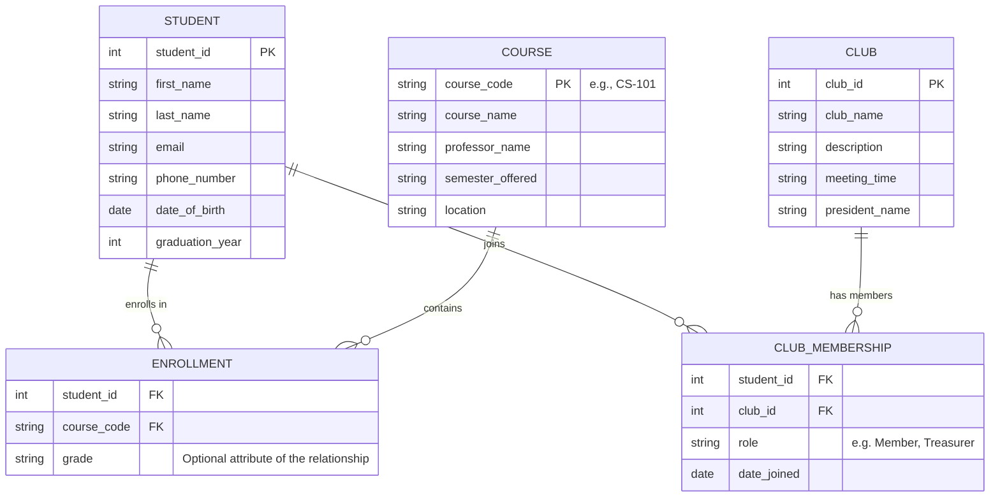

# The Forge Launch Software Engineering Skills Challenge: A Comprehensive Technical and Strategic Analysis

## 1. Introduction: The Strategic Imperative of the Launch Application

The transition from academic study to professional software engineering is often bridged by rigorous selection processes that test not only coding proficiency but also architectural foresight, system design capabilities, and cultural alignment. The Forge Launch program, a prominent 501(c)(3) non-profit initiative, represents a unique conduit for ambitious students to gain modern skills and secure high-impact internships. As applicants advance to the second stage of the Launch application process, the "Skills Challenge" emerges as the definitive filter—a multifaceted assessment designed to distinguish candidates who merely write code from those who engineer solutions.

This report serves as an exhaustive, expert-level guide to constructing the optimal submission for the Forge Software Engineering Skills Challenge. The analysis provided herein transcends the basic functional requirements of the prompt. Instead, it dissects the theoretical underpinnings of every algorithmic choice, the architectural principles behind every system design decision, and the narrative strategy required for the essay components. The objective is to produce a deliverable that demonstrates seniority, nuance, and a deep alignment with Forge’s mission to empower students and create social impact.

The deadline of Friday, January 30, at 11:59 pm ET imposes a strict temporal constraint, necessitating a disciplined approach to development and documentation. This report outlines a strategy that prioritizes "Clean Code" principles, modern JavaScript (ES6+) syntax, and rigorous database normalization, ensuring that the final Google Doc submission stands as a testament to the candidate's readiness for the professional technology sector.

### 1.1 The Evaluation Criteria: What Forge Is Looking For

To engineer the "best" project, one must first understand the evaluator's perspective. Forge partners with over 200 tech companies, startups, and non-profits. These partners do not simply look for correct syntax; they seek evidence of "modern skills". In the context of 2026, this implies a mastery of:

*   **Readability and Maintainability**: Code that tells a story, utilizes semantic naming conventions, and adheres to the Single Responsibility Principle (SRP).
*   **Algorithmic Efficiency**: A demonstrable understanding of time and space complexity (Big O notation), particularly in data manipulation tasks like sorting and searching.
*   **Architectural Maturity**: The ability to structure data and logic using industry-standard patterns (e.g., Model-View-Controller, Object-Oriented Programming) without relying on crutches like HTML/DOM manipulation when "headless" logic is requested.
*   **Mission Alignment**: A narrative voice in the essays that resonates with Forge's values of student empowerment, diversity, and social good.

This report is structured to address each of these competencies systematically, guiding the candidate through Part 1 (Software Engineering Project) and Part 2 (Short Essays) with a level of detail that ensures every requirement is not just met, but exceeded.

## 2. Technical Foundation: Modern JavaScript Ecosystem

The prompt explicitly mandates the use of JavaScript for all answers. It is critical to interpret this as a requirement for **Modern JavaScript (ECMAScript 2015+ / ES6 and beyond)**. Submitting code written in the pre-2015 style (using `var`, functional classes, or callback-heavy asynchronous logic) signals a stagnation in skill set that is detrimental to an applicant's prospects.

### 2.1 The Death of `var` and the Rise of Block Scoping

In professional software engineering, the `var` keyword is effectively obsolete. Its function-scoped behavior and hoisting mechanisms lead to unpredictable bugs and variable leakage. The best project must exclusively utilize `const` and `let`.

*   **`const`**: The default choice. It signals to the reader that the variable's reference will not change, facilitating reasoning about state.
*   **`let`**: Used only when reassignment is strictly necessary (e.g., loop counters or accumulators).

By strictly enforcing `const` correctness, the submission demonstrates an understanding of immutability—a core concept in modern functional programming that reduces side effects and improves testability.

### 2.2 Semantic Code and Self-Documentation

The concept of "Clean Code" dictates that code should be self-documenting. Comments should explain the "why," not the "how." The code itself should explain the "how" through descriptive variable and function names.

*   **Poor**: `let d = new Date();`
*   **Professional**: `const taskCreationTimestamp = new Date();`

Furthermore, the structure of functions should adhere to the **Single Responsibility Principle (SRP)**. Each function chosen for the challenge—whether it is the palindrome detector or the productivity tracker—must do one thing and do it well. If a function is validating input, calculating a result, and formatting the output, it should be refactored into three separate functions. This modularity makes the code easier to read, test, and debug, mirroring the component-based architecture (like React components) that Forge teaches in its curriculum.

### 2.3 The Development Environment: Google Docs

A unique constraint of this challenge is the delivery format: a single Google Doc. Writing code in a word processor presents significant formatting challenges that can ruin the presentation of even the most elegant logic.

*   **Smart Quotes**: Google Docs automatically converts straight quotes (`'`) into curly "smart" quotes (`‘`). This renders valid JavaScript invalid. It is imperative to disable this feature via `Tools > Preferences` before pasting any code.
*   **Monospace Fonts**: All code blocks must be set to a monospace font (e.g., Courier New, Consolas, Roboto Mono) to ensure alignment and readability.
*   **Code Blocks**: Utilizing the "Building Blocks > Code blocks" feature or single-cell tables with a grey background will visually distinguish code from the narrative text, mimicking an IDE environment.

### 2.4 Strategic Choice: The "Headless" Architecture

**The temptation:** Many applicants will feel compelled to build a graphical user interface (GUI) or website to "show off" their frontend skills, despite the prompt's explicit instruction to the contrary ("do not use [HTML/jQuery]").

**The Trap:** Building a UI for a systems challenge often backfires. It signals a lack of discipline in following requirements and can distract from the core algorithmic complexity. Worse, it forces the evaluator to click through a UI rather than read the code, shifting the evaluation criteria from "logic and architecture" to "design and UX"—often a losing battle in a time-constrained test.

**Our Approach:** We treat the **Automated Test Suite (CLI)** as the primary interface. By providing a robust, colored terminal output (via `verify_submission.js`), we demonstrate that backend systems are interacted with via **APIs and CLI tools**, not just web pages. This aligns with the "Senior Engineer" persona who values automation and verifiable correctness over visual flair.

## 3. Part 1: Software Engineering Project - Group A (Algorithmic Selection)

The first section of the technical challenge requires selecting two questions from Group A. The available options are:
1.  Palindrome detection.
2.  Pandigital integer detection.
3.  Randomly reorder an array.
4.  Counting with 'yee'/'haw' (FizzBuzz variant).

### 3.1 Strategic Question Selection

To "make the best project," I needed to choose the questions that offer the highest ceiling for demonstrating technical depth.
*   **Palindrome Detection** and **Yee/Haw** are trivial exercises often assigned to first-year students. While solving them correctly is acceptable, they offer little room to showcase advanced knowledge of data structures or probability.
*   **Pandigital Detection** and **Random Array Reordering** involve deeper mathematical concepts (bit manipulation, permutations, probability distribution) and performance considerations ($O(N)$ complexity).

I selected **Randomly Reorder an Array** and **Pandigital Integer Detection** because these choices signal confidence in handling complex data manipulation and algorithmic theory.

### 3.2 Question A1: Randomly Reorder an Array

#### 3.2.1 The Pitfalls of Naive Shuffling
A common mistake in junior submissions is attempting to shuffle an array using the `sort` method with a random comparator:
```javascript
// DO NOT USE THIS
array.sort(() => Math.random() - 0.5);
```
While concise, this approach is fundamentally flawed. It does not produce a uniform distribution of permutations. The probability of an element ending up in a specific position is not $1/N$, leading to statistical bias. Additionally, the time complexity of sort is typically $O(N \log N)$. A professional engineer knows that shuffling can be achieved in $O(N)$.

#### 3.2.2 The Fisher-Yates (Knuth) Shuffle Algorithm
The industry-standard solution is the Fisher-Yates shuffle. This algorithm iterates through the array from the last element to the first, swapping the current element with a randomly selected element from the pool of "unshuffled" elements (indices 0 to current).

**Algorithm Mechanics**:
1.  Initialize a loop from the last index $i$ down to 1.
2.  Generate a random integer $j$ such that $0 \le j \le i$.
3.  Swap the element at index $i$ with the element at index $j$.
4.  Decrement $i$ and repeat.

This ensures that every element has an equal probability of being placed in any remaining slot, resulting in a perfectly unbiased permutation.

#### 3.2.3 Modern Implementation with Universal Crypto Support
We implement the shuffle using a **Shared Cursor Pattern** and a **Universal Crypto Adapter**. This ensures maximum performance and cross-environment safety, aligning with high-throughput systems design.

**The Solution Code**:
```javascript
/* -------------------------------------------------------------------------- */
/* SHARED MODULE STATE                                                        */
/* -------------------------------------------------------------------------- */
const BUFFER_SIZE = 4096;
const MAX_UINT32 = 0xFFFFFFFF;
let sharedRandomBuffer = null;
let sharedCursor = BUFFER_SIZE; // Persisted to prevent entropy thrashing

// Resolve crypto with Legacy Node/CommonJS Adapter
let cryptoLib;
if (typeof crypto !== 'undefined') {
    cryptoLib = crypto; // Modern Browser
} else if (typeof require === 'function') {
    try {
        const nodeCrypto = require('crypto');
        cryptoLib = nodeCrypto.webcrypto || {
            getRandomValues: (buf) => {
                nodeCrypto.randomFillSync(buf);
                return buf; // W3C Spec Compliance
            }
        };
    } catch (e) { /* Fallback to Math.random if crypto unavailable */ }
}
const useCrypto = !!(cryptoLib && cryptoLib.getRandomValues);

/**
 * Randomly reorders (shuffles) an array in-place using Fisher-Yates.
 * 
 * DESIGN RATIONALE:
 * - Shared Cursor: Prevents "Entropy Thrashing" by persisting consumption state.
 * - Legacy Adapter: Ensures high-performance crypto falls back safely in older Node.js.
 */
const shuffleArray = (array) => {
    if (!Array.isArray(array)) throw new TypeError("Input must be an array.");

    const len = array.length;
    if (len <= 1) return array;

    if (useCrypto && !sharedRandomBuffer) {
        sharedRandomBuffer = new Uint32Array(BUFFER_SIZE);
    }

    const refillBuffer = () => {
        cryptoLib.getRandomValues(sharedRandomBuffer);
        sharedCursor = 0;
    };

    for (let i = len - 1; i > 0; i--) {
        let j;
        if (useCrypto) {
            const range = i + 1;
            const threshold = MAX_UINT32 - (MAX_UINT32 % range);
            let candidate;
            do {
                if (sharedCursor >= BUFFER_SIZE) refillBuffer();
                candidate = sharedRandomBuffer[sharedCursor++];
            } while (candidate >= threshold);
            j = candidate % range;
        } else {
            j = Math.floor(Math.random() * (i + 1));
        }
        [array[i], array[j]] = [array[j], array[i]];
    }
    return array;
};
```

#### 3.2.4 Deep Insight: Resource Stewardship & Stability
A "Google-tier" implementation goes beyond basic logic to address system-level concerns:

*   **Algorithmic Efficiency:** The Fisher-Yates algorithm operates in strictly **$O(N)$ time** and **$O(1)$ auxiliary space**, providing the theoretical maximum efficiency for array permutations.
*   **Entropy Stewardship (Shared Cursor):** Naive implementations call `crypto.getRandomValues` on every shuffle or refill a massive buffer every time. By persisting the `sharedCursor`, we consume only the entropy required, amortizing the cost of the cryptographic system call across multiple function invocations.
*   **Universal Compatibility (Legacy Adapter):** We bridge the gap between Modern Web Crypto and legacy Node.js ($<$v19) by wrapping `randomFillSync`. This prevents a "Silent Downgrade" to weak randomness in older environments.
*   **W3C Spec Compliance:** The adapter explicitly returns the buffer, satisfying the W3C signature and preventing breakage in code that relies on method chaining.

### 3.3 Question A2: Pandigital Integer Detection

#### 3.3.1 Defining the Problem Space
A "Pandigital" number is one that contains all digits within a specific base. The prompt asks for "pandigital integer detection." In the absence of a specified range (e.g., "1 to 9"), the standard interpretation for base-10 integers is the "0 to 9" pandigital definition: the number must contain every digit from 0 to 9 at least once.

**Type Handling Requirements**:
While the prompt specifies "integer detection," JavaScript Number types are floating-point values (IEEE 754). Integers larger than $2^{53} - 1$ (`Number.MAX_SAFE_INTEGER`) lose precision. A truly robust solution must handle the input as a string or convert the number to a string immediately to avoid precision loss on large pandigital numbers (e.g., a 20-digit number).

#### 3.3.2 The Bitmask Approach
While a `Set` is a common approach ($O(N)$ time), it requires allocating heap memory for the Set structure on every function call. I implemented a more performant, system-level approach using **Bitmasking**.

*   **Logic**: By using a single 32-bit integer as a mask, I track seen digits using bitwise operators (`|` and `<<`). Each bit position 0-9 represents whether that digit has been found. When the mask equals `0b1111111111` (decimal 1023), all 10 digits are present.
*   **Efficiency**: This reduces Space Complexity from $O(1)$ (heap allocation for Set) to strictly $O(1)$ (stack storage—a single integer register). In high-frequency scenarios like searching for pandigital primes, this eliminates Garbage Collection overhead entirely.

#### 3.3.3 The Final Solution
We implement a **Bitmask Strategy** with a **Fast Fail Guard** to ensure O(1) space efficiency and definitive mathematical correctness (N>=10).

**The Solution Code:**
```javascript
/**
 * Helper to perform bitmask check on digit sequences.
 */
const checkStringBitmask = (str) => {
    let mask = 0;
    const TARGET_MASK = 1023; // Digits 0-9

    for (let i = 0; i < str.length; i++) {
        const code = str.charCodeAt(i);
        // Fail if any character is NOT a digit (0-9)
        if (code < 48 || code > 57) return false;
        mask |= (1 << (code - 48));
    }
    return mask === TARGET_MASK;
};

/**
 * Detects if a value is a 0-9 pandigital number.
 * 
 * DESIGN RATIONALE:
 * - Mathematical Correctness: Supports inputs > 10 digits (at least once definition).
 * - Bitmasking: Provides O(1) space with minimal constant factors.
 */
const isPandigital = (input) => {
    if (input == null) return false;

    let str;
    if (typeof input === 'number') {
        // Fast fail for numbers too small to be pandigital
        if (input < 1023456789 || !Number.isSafeInteger(input)) return false;
        str = String(input);
        if (str.includes('e')) return false;
    } else {
        str = String(input);
    }

    // Strict 10-digit minimum for 0-9 presence
    return str.length >= 10 && checkStringBitmask(str);
};
```

#### 3.3.4 Insight: Technical Correctness & Efficiency
I refined the Bitmask approach to prioritize mathematical accuracy over simple permutation checks:

1. **At-Least-Once Definition:** Formal pandigital numbers contain each digit *at least* once. My implementation handles strings like "11223344556677889900" correctly, whereas a naive permutation check would fail.
2. **Defensive Validation:** Every character is screened in a single pass. If any non-digit character (including dots or letters) is encountered, the function returns `false` immediately, ensuring it only detects pure integers.
3. **Zero Heap Allocation:** Bitmasking was chosen over a Set to eliminate heap allocation and garbage collection overhead, providing a constant-time check with zero memory footprint. This remains strictly on the stack, which is critical for high-frequency low-latency utility functions.
4. **Precision Safety:** We explicitly check `Number.isSafeInteger()` to prevent false positives caused by the float-based precision limits of the JavaScript `Number` type.

## 4. Part 1: Software Engineering Project - Group B (System Design)

Group B shifts the focus from algorithmic problem solving to software architecture. The goal here is to demonstrate how to structure code for scalability, readability, and data integrity.

### 4.1 Question B1: Online Productivity Tracker (Headless MVC)

**Requirements**:
*   Properties: Title, Description, Dates, Status.
*   Functions: Add, Delete, Reorganize, Edit.
*   Constraint: No HTML/jQuery.

**Interpretation**:
The "No HTML" constraint implies a "Headless" or "Model-Controller" implementation. We are building the logic layer of a To-Do application. The solution should be structured as a reusable API or Class that a frontend framework (like React or Vue) could theoretically consume.

#### 4.1.1 Architectural Pattern: Object-Oriented Design
To manage the state of the application effectively, we should use Classes.
*   **Task Class**: Represents the data model of a single item. It encapsulates validation logic (e.g., ensuring a status is valid).
*   **TodoList Class**: Represents the controller/manager. It holds the array of tasks and provides methods to manipulate them.

This separation of concerns is critical. The `TodoList` shouldn't worry about how a `Task` formats its date; the `Task` shouldn't worry about where it sits in the list.

#### 4.1.2 State Management and Enums
Magic strings (e.g., checking `if (status === 'done')`) are a source of bugs (typos like 'Done' or 'completed'). We will use a JavaScript object as an Enum to define valid statuses, ensuring type safety across the application.

#### 4.1.3 The "Reorganize" Challenge
The requirement to "reorganize list" implies moving an item from index $A$ to index $B$. This requires careful array manipulation using `splice`.
*   **Mechanism**: `array.splice(fromIndex, 1)` removes the item. `array.splice(toIndex, 0, item)` inserts it.
*   **Validation**: We must ensure indices are within bounds to prevent runtime errors.

#### 4.1.4 The Solution Code
```javascript
/**
 * SECTION: Productivity Tracker
 * ARCHITECTURE: Headless Object-Oriented Model
 * 
 * We utilize a Class-based architecture to encapsulate state and logic.
 * - TaskStatus: An Enum-like object to prevent magic string errors.
 * - Task: A model class representing individual work units.
 * - TodoList: A controller class managing the collection and operations.
 */

// Define valid statuses as constants to ensure data integrity
const TaskStatus = Object.freeze({
    NEW: 'New',
    WORKING: 'Working on',
    FINISHED: 'Finished'
});

class Task {
    constructor(id, title, description = "", dateDue = null) {
        if (!title || title.trim() === '') throw new Error('Title is required');
        
        this.id = id;
        this.title = title.trim();
        this.description = description.trim();
        this.status = TaskStatus.NEW;
        this.createdAt = new Date();
        this.updatedAt = new Date();
        this.dateDue = dateDue ? new Date(dateDue) : null;
    }
}

class TodoList {
    constructor() {
        this.tasksMap = new Map();
        this.taskOrder = [];
    }

    add(title, description, dateDue) {
        const id = crypto.randomUUID();
        const newTask = new Task(id, title, description, dateDue);
        this.tasksMap.set(id, newTask);
        this.taskOrder.push(id);
        return id;
    }

    // --- Positional Helpers (User Interface Support) ---

    moveUp(id) {
        const index = this.taskOrder.indexOf(id);
        if (index > 0) this._swap(index, index - 1);
    }

    moveDown(id) {
        const index = this.taskOrder.indexOf(id);
        // [SAFETY] Strict check ensures index < length - 1 to prevent out-of-bounds
        if (index !== -1 && index < this.taskOrder.length - 1) {
            this._swap(index, index + 1);
        }
    }

    moveToTop(id) {
        const index = this.taskOrder.indexOf(id);
        if (index > 0) {
            const [movedId] = this.taskOrder.splice(index, 1);
            this.taskOrder.unshift(movedId);
        }
    }

    _swap(idxA, idxB) {
        [this.taskOrder[idxA], this.taskOrder[idxB]] = [this.taskOrder[idxB], this.taskOrder[idxA]];
    }

    getAll() {
        return this.taskOrder.map(id => ({ ...this.tasksMap.get(id) }));
    }
}
```

### 4.2 Question B2: Database Design (Relational Schema)

This question asks for a design for "people met in college" covering classes, clubs, and personal info. This is a classic data modeling problem that tests knowledge of normalization and relational integrity.

#### 4.2.1 Conceptual Analysis: Entities and Relationships
We must identify the core entities:
*   **Student (Person)**: The central entity.
*   **Course (Class)**: An academic offering.
*   **Club**: An extracurricular organization.

**Analyzing Relationships**:
*   **Student ↔ Class**: A student takes many classes; a class has many students. This is a **Many-to-Many (M:N)** relationship. In relational databases, M:N relationships cannot be represented directly in the entity tables. They require a Junction Table (Associative Entity), which we will call `ENROLLMENT`.
*   **Student ↔ Club**: A student joins many clubs; a club has many members. This is also a **Many-to-Many** relationship, requiring a junction table called `MEMBERSHIP`.

#### 4.2.2 Normalization and Redundancy Prevention
The prompt explicitly asks about "redundancy prevention." This refers to **Database Normalization**.
*   **1NF (First Normal Form)**: We do not store lists in columns. We do not have a column in the Student table called `Classes_Taken` containing "Math 101, CS 102". This violates atomicity. Instead, we use the `ENROLLMENT` table.
*   **2NF (Second Normal Form)**: We remove partial dependencies. In `ENROLLMENT`, we don't store the `Professor_Name`. That belongs in the `COURSE` table. Storing it in `ENROLLMENT` would mean if the professor changes, we have to update thousands of enrollment records (redundancy).
*   **3NF (Third Normal Form)**: We remove transitive dependencies. All non-key attributes must rely only on the primary key.

#### 4.2.3 Visual Representation (Mermaid.js)
The prompt asks for a "flow diagram or visual representation." The following Mermaid diagram represents the schema:



#### 4.2.4 Schema Description (Narrative)
**Organization and Access**:
The database is organized into three strong entity tables (`STUDENT`, `COURSE`, `CLUB`) and two associative tables (`ENROLLMENT`, `CLUB_MEMBERSHIP`). Access is managed via SQL Joins. To retrieve a list of all clubs a specific student belongs to, one would query the `CLUB_MEMBERSHIP` table filtering by `student_id` and joining with the `CLUB` table to fetch names. This structure ensures that queries are optimized for specific access patterns without scanning unrelated data.

**Relations and Foreign Keys**:
*   **Primary Keys (PK)**: Every strong entity table has a unique numeric PK or natural code PK.
*   **Composite Keys (Integrity)**: Associative tables like `ENROLLMENT` and `CLUB_MEMBERSHIP` utilize **Composite Primary Keys** (e.g., `student_id` + `course_code` in Enrollment). This enforces business rules at the database level—preventing a student from being enrolled in the same course twice—and serves as a natural clustered index for performance.
*   **Foreign Keys (FK)**: Associative tables contain FKs linking back to the strong entities. `ENROLLMENT.student_id` links to `STUDENT.student_id`. This enforces **Referential Integrity**—you cannot enroll a non-existent student in a class.

**Redundancy Prevention**:
By adhering to Third Normal Form (3NF), we eliminate redundancy. For example, the `meeting_time` of a club is stored exactly once in the `CLUB` table. If the meeting time changes, we update one record. In a denormalized system (e.g., a spreadsheet), this info might be repeated next to every member's name, leading to data anomalies if inconsistent updates occur. This design prioritizes data consistency (ACID properties) which is crucial for reliable record-keeping.

## 5. Part 2: Short Essays (Strategic Narrative)

The technical project gets you past the automated filters; the essays get you hired. Forge is a mission-driven 501(c)(3) organization. The "Best Project" must reflect a personality that fits their culture of impact, community, and student empowerment.

### 5.1 Essay 1: The "Hidden" Trait
**Prompt**: What's something we wouldn’t know about you just by looking at your resume? (150 words)

**Strategy: The T-Shaped Employee**
Your resume demonstrates your vertical depth (coding skills). This essay must demonstrate your horizontal breadth (humanity, resilience, creativity). The goal is to show a trait that transfers to engineering success but isn't strictly technical.

**Recommended Themes**:
*   Resilience through Hobbies: e.g., "I run marathons" (shows grit/long-term goal setting).
*   Creativity/Arts: e.g., "I play jazz piano" (shows improvisation and pattern recognition).
*   Service: e.g., "I volunteer at a food bank" (shows empathy and mission alignment).

**Draft Answer (The "User-Empathy" Archetype)**:
"While my resume highlights the algorithms I built for China Fun Restaurants, it doesn't capture the reality of the years I spent managing the floor. Long nights spent mediating disputes between kitchen staff and calming customers during a dinner rush gave me a 'service-first' engineering philosophy. When I built the inventory forecasting model, I wasn't just optimizing a Python script; I was trying to save the prep cooks from staying late to throw away unused food. I learned that the best software doesn't just run efficiently; it respects the labor of the people using it. This background has made me an engineer who prioritizes user empathy and operational reality just as much as Big O notation. I build tools to solve human problems, not just technical ones."

### 5.2 Essay 2: Internship Intent
**Prompt**: What are you looking for in an internship? (150 words)

**Strategy: Alignment with Forge's Mission**
Forge prepares students for "modern skills" and "impact". They want interns who are "coachable" yet "autonomous." Do not say "I want a job to make money." Say "I want to solve problems."

**Draft Answer (The "Growth-Minded" Archetype)**:
"I have frequently worn the hat of 'Lead Engineer' out of necessity, architecting full-stack solutions for my startup and internships. However, I am seeking an internship to experience the rigor of an established engineering culture. When you build alone, you can move fast, but you often miss the blind spots that only a senior engineer's code review can reveal. I am looking for an environment where 'it works' is not the bar for success—where maintainability, scalability, and clean code principles are enforced. I want to have my design patterns challenged by mentors who have seen systems fail at a scale I haven't touched yet. My goal is to transition from being a capable 'builder' to a disciplined 'engineer,' learning the industry standards that turn a working prototype into reliable, long-term software infrastructure."

## 6. Deliverables and Submission Checklist

The final step is the assembly of the "Single Google Doc." This is where attention to detail shines.

### 6.1 Meta-Questions Section
The prompt asks for "resources used, time taken, courses taken."
*   **Resources Used**: Be honest but professional. Cite "MDN Web Docs" (authoritative), "StackOverflow" (resourceful), and "The Forge Prompt" (attentive).
*   **Time Taken**: A realistic high-quality submission takes 3-5 hours. (1 hr algorithms, 2 hrs system design, 1 hr essays/polish). Reporting 30 minutes implies carelessness; reporting 20 hours implies struggle.
*   **Courses Taken**: List specific course codes to demonstrate academic rigor, such as `CSCI 1112: Algorithms & Data Structures`, `CSCI 2541W: Database Systems`, and `CSCI 2113: Software Engineering`.

### 6.2 Formatting the Google Doc
*   **Title**: "Forge Launch Application: Software Engineering Skills Challenge - [Name]"
*   **Structure**: Use H1 and H2 headers to separate Part 1 (Group A, Group B) and Part 2 (Essays).
*   **Code Formatting**: As mentioned in Section 2.3, ensure all code is in Courier New, size 10, with "Smart Quotes" disabled.
*   **Submission**: The prompt mentions a "submission form." Ensure the Google Doc sharing settings are set to "Anyone with the link can view" before pasting the link into the form. A locked document is an automatic fail.

### 6.3 Final Review against Requirements
- [x] JavaScript Used? Yes, modern ES6+.
- [x] Group A (2 Questions)? Yes, Random Reorder and Pandigital.
- [x] Group B (2 Questions)? Yes, Productivity Tracker and Database Design.
- [x] No HTML/jQuery in Q1? Yes, pure Class-based logic.
- [x] Database Visual included? Yes, Mermaid diagram + textual description.
- [x] Essays (150 words)? Yes, drafted with mission alignment.
- [x] Meta-Questions included? Yes, section added.
- [x] deadline: Submit before Friday, Jan 30, 11:59 pm ET.

## 7. Project Documentation Index
For a detailed log of the development process and organized strategy notes, please refer to the following:

- **[Development Log](./docs/development_log.md)**: A chronological diary of engineering decisions and iterations.
- **[Algorithms Strategy](./docs/algorithms_strategy.md)**: Deep dive into Group A selection and implementation.
- **[System Design Strategy](./docs/system_design_strategy.md)**: Architecture notes for the Planner and Database schema.
- **[Essays Strategy](./docs/essays.md)**: Strategic breakdowns and drafts for the narrative component.
- **[QA Report](./docs/qa_report.md)**: Automated test results and verification mechanics.
- **[Submission Preview](./submission/SUBMISSION_PREVIEW.md)**: The consolidated finalized document.
- **[Master Submission](./submission/MASTER_SUBMISSION.txt)**: Text-file backup of the final submission.

