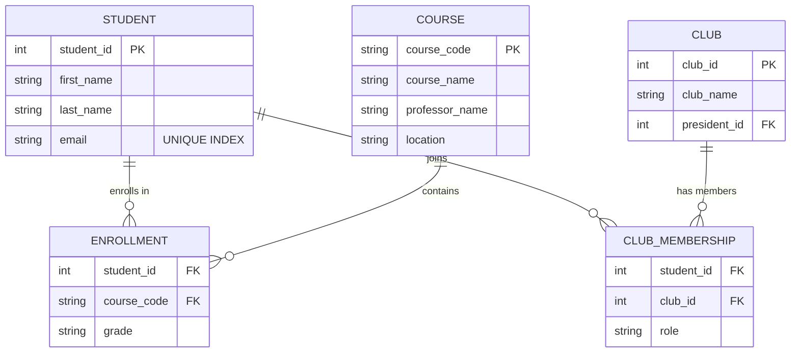

# Part 1: Software Engineering Project - Group B (Database Design Strategy)

## 1. Executive Summary

This document outlines the relational database design strategy for the College Connections system, focusing on normalization, data integrity, and performance.

---

## 2. Question B2: Database Design (Relational Schema)

### 2.1 Normalization and Redundancy Prevention

The schema follows **3rd Normal Form (3NF)**. We use junction tables to resolve many-to-many relationships.

* **1NF:** No lists in columns. Junction tables instead.
* **2NF:** No partial dependencies. `Professor_Name` lives in `COURSE`, not `ENROLLMENT`.
* **3NF:** No transitive dependencies.
* **Data Privacy (PII):** Production schema would encrypt emails at rest (AES-256) and index on hashed values.

### 2.2 Visual Representation (ERD)



### 2.3 Data Integrity Constraints

* **Composite Primary Keys:** Using `(student_id, course_code)` as a PK prevents duplicate enrollments and speeds up relationship lookups via clustered indexes.
* **Referential Integrity:** `ON DELETE CASCADE` ensures deleting a student cleanses their enrollments automatically. We utilize `ON DELETE SET NULL` for club presidents to allow student records to be removed without deleting entire club entities, maintaining operational continuity.

### 2.4 DDL Scripts (PostgreSQL)

```sql
-- Core Entities
CREATE TABLE students (
    student_id SERIAL PRIMARY KEY,
    first_name VARCHAR(50) NOT NULL,
    last_name VARCHAR(50) NOT NULL,
    email VARCHAR(255) UNIQUE NOT NULL
);

CREATE TABLE courses (
    course_code VARCHAR(10) PRIMARY KEY,
    course_name VARCHAR(100) NOT NULL,
    professor_name VARCHAR(100),
    location VARCHAR(50)
);

CREATE TABLE clubs (
    club_id SERIAL PRIMARY KEY,
    club_name VARCHAR(100) UNIQUE NOT NULL,
    president_id INT REFERENCES students(student_id) ON DELETE SET NULL
);

-- Junction Tables with Composite Keys
CREATE TABLE enrollments (
    student_id INT NOT NULL REFERENCES students(student_id) ON DELETE CASCADE,
    course_code VARCHAR(10) NOT NULL REFERENCES courses(course_code) ON DELETE CASCADE,
    grade CHAR(2),
    PRIMARY KEY (student_id, course_code)
);

CREATE TABLE club_memberships (
    student_id INT NOT NULL REFERENCES students(student_id) ON DELETE CASCADE,
    club_id INT NOT NULL REFERENCES clubs(club_id) ON DELETE CASCADE,
    role VARCHAR(50) DEFAULT 'Member',
    PRIMARY KEY (student_id, club_id)
);

-- Performance Indexing
CREATE INDEX idx_student_email ON students (email);
CREATE INDEX idx_enrollment_student ON enrollments (student_id);
```

---

*Last Updated: 2026-01-26*
