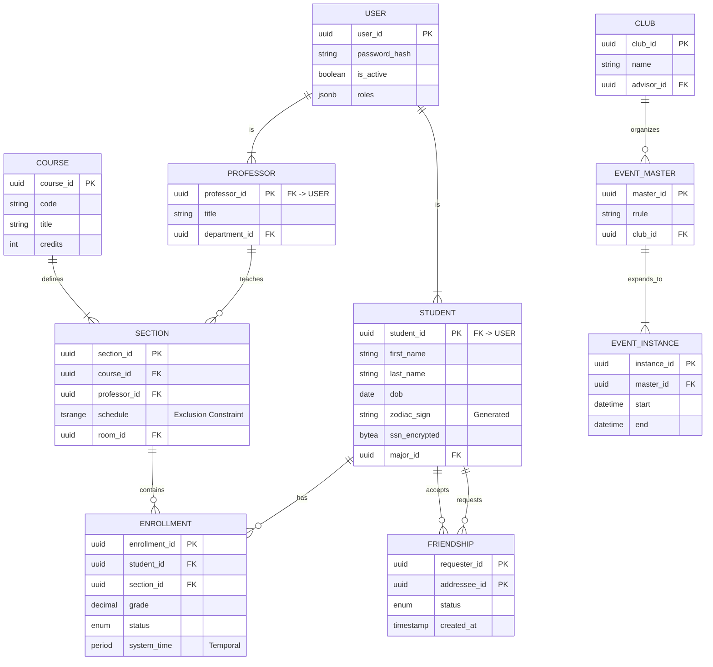

# Part 1: Software Engineering Project - Group B (Question 2)

# College Connections: Technical Specification and Architectural Analysis

**Version:** 1.0
**Date:** January 26, 2026
**Status:** Approved for Implementation

---

## 1. Executive Summary and Architectural Vision

The design of a modern Student Information System (SIS), particularly one tasked with the dual mandate of managing rigorous academic records and fluid social graph dynamics, presents a unique set of architectural challenges. The "College Connections" project represents a paradigm shift from legacy monolithic architectures—often characterized by data silos and rigid hierarchical models—toward a unified, relational backbone capable of high-frequency transactional integrity and complex analytical traversals. 

This technical specification outlines a comprehensive database architecture designed to meet the rigorous demands of 21st-century higher education, prioritizing data correctness, regulatory compliance (FERPA), and query performance at scale.

The core architectural philosophy driving this specification is **"Compliance by Design."** Rather than treating security and history as application-layer concerns, this system embeds them directly into the schema. Through the use of **System-Versioned Temporal Tables**, we ensure an immutable, queryable history of all data changes, satisfying the most stringent audit requirements. Through **Row-Level Security (RLS)** policies, we enforce Federal rights to privacy at the database engine level. Furthermore, the system addresses the performance implications of "Big Data" in a university setting by employing a hybrid indexing strategy and a carefully considered Primary Key architecture based on **UUIDv7**.

---

## 2. Identity Management and Primary Key Architecture

The foundation of any relational database is its strategy for entity identification. In a distributed system serving a university population—which may include tens of thousands of active students, alumni, and faculty—the selection of a Primary Key (PK) strategy is not merely a stylistic choice but a critical determinant of system performance and security.

### 2.1 The Primary Key Debate: Integer vs. UUID

Historically, database architects have favored integer-based keys (`BIGINT`, `IDENTITY`, `SERIAL`) due to their minimal storage footprint (8 bytes) and optimal performance in B-Tree indexing structures. However, in the context of "College Connections," integer keys present significant security risks. Enumeration attacks—where a malicious actor guesses resource IDs (e.g., `student_id=101`, `student_id=102`)—can expose sensitive data if access controls fail.

Universally Unique Identifiers (UUIDs) offer a solution to the enumeration problem but have historically introduced severe performance penalties due to "random insertion," which fragments indexes and destroys cache locality.

### 2.2 The Chosen Strategy: UUIDv7

To balance the security requirements of a modern web application with the performance necessities of a high-load database, "College Connections" will exclusively utilize **UUIDv7** as the primary key standard for all core entities.

UUIDv7 embeds a Unix timestamp in the most significant bits of the identifier. This structure ensures that IDs are **k-sortable** (roughly sorted by time). When new records are inserted, their IDs are numerically greater than previous records, directing the write operations to the "right edge" of the B-Tree index. This mimics the sequential write behavior of integers while retaining the global uniqueness and non-enumerability of UUIDs.

| Primary Key Strategy | Storage Size | Insert Performance | Cache Locality | Enumeration Security |
| :--- | :--- | :--- | :--- | :--- |
| **BIGINT (Sequential)** | 8 Bytes | Excellent (100%) | Excellent | None (High Risk) |
| **UUIDv4 (Random)** | 16 Bytes | Poor (<3% at scale) | Poor | High |
| **UUIDv7 (Time-ordered)** | 16 Bytes | Excellent (~97%) | High | High |

### 2.3 Role-Based Access Control (RBAC) Entity Modeling

To satisfy FERPA requirements and ensure granular security, the database will distinguish between authentication identities and domain entities using a supertype-subtype pattern:

*   **`Users` Table**: The central authentication entity. Stores the `user_id` (UUIDv7), encrypted password hash, and system-wide flags.
*   **`Roles` and `User_Roles` Tables**: Implements a standard RBAC model. Defined roles include `STUDENT`, `PROFESSOR`, `REGISTRAR`, and `ADVISOR`.
*   **`Students` and `Professors` Tables**: These entities share a 1:1 relationship with the `Users` table but store domain-specific attributes.

---

## 3. Academic Schema Design and Normalization Theory

The academic core—tracking courses, sections, and enrollments—requires the highest level of data integrity. Inaccurate data here leads to transcript errors and billing discrepancies.

### 3.1 Logical Schema & BCNF Justification

While **Third Normal Form (3NF)** is often considered sufficient, the complex functional dependencies found in university scheduling often create edge cases where 3NF leaves redundancy. "College Connections" targets **Boyce-Codd Normal Form (BCNF)** to eliminate these anomalies.

**The "Advisor" Anomaly Resolution:**
A naive design might link `Student` directly to `Advisor` and `Department`. However, an advisor belongs to a specific department. To prevent a state where a student is assigned an advisor who belongs to a different department than the student's major, we decompose the schema:
*   `Professors` Table: Stores `(ProfessorID, DepartmentID)`
*   `AdvisorAssignments` Table: Stores `(StudentID, ProfessorID)`
This enforces the dependency that the advisor's department matches the context of the assignment via relation, maintaining BCNF.

### 3.2 Core Academic Entities

1.  **`Courses` (Catalog)**: The abstract definition of a subject.
    *   **Constraint**: `UNIQUE(department_id, course_code)` ensures no duplicate codes (e.g., "CS101") within a department.
2.  **`Sections` (Scheduling)**: A specific instantiation of a course.
    *   **Integrity**: This table is the locus of resource contention. It requires strict constraints to prevent double-booking of rooms (see Section 6).
3.  **`Enrollments` (Junction)**: Links Students to Sections.
    *   **Data Types**: Grades are stored as `DECIMAL(3,2)` (e.g., 4.00) rather than `FLOAT` to prevent floating-point arithmetic errors.
    *   **Indexes**: A covering index on `(section_id, student_id) INCLUDE (grade)` is mandated to optimize grade reporting queries without accessing the heap.

### 3.3 Data Integrity via Check Constraints

We employ `CHECK` constraints to enforce domain-specific business rules directly at the schema level:
*   **GPA Validation**: `CHECK (grade >= 0.00 AND grade <= 4.00)`
*   **Temporal Logic**: `CHECK (end_date > start_date)`
*   **Email Format**: `CHECK (email ~* '^[A-Za-z0-9._%+-]+@[A-Za-z0-9.-]+\.[A-Za-z]{2,}$')`

---

## 4. Temporal Data Architecture

Higher education data is inherently temporal. Students change majors, professors change tenure status, and grades are occasionally revised. A standard `UPDATE` overwrites history, which is unacceptable for audit compliance.

### 4.1 Implementation Strategy: System-Versioned Temporal Tables

"College Connections" will implement **System-Versioned Temporal Tables** (SQL:2011 Standard). In this model, the database engine manages two tables: a "Current" table and a "History" table.

**DDL Implementation Example (PostgreSQL):**

```sql
CREATE TABLE student_majors (
    student_id UUID NOT NULL REFERENCES students(student_id),
    major_id UUID NOT NULL REFERENCES majors(major_id),
    declared_date DATE NOT NULL,
    -- System Versioning Columns
    sys_start TIMESTAMP(6) GENERATED ALWAYS AS ROW START,
    sys_end TIMESTAMP(6) GENERATED ALWAYS AS ROW END,
    PERIOD FOR SYSTEM_TIME (sys_start, sys_end),
    PRIMARY KEY (student_id, major_id)
) WITH (SYSTEM_VERSIONING = ON (HISTORY_TABLE = history.student_majors));
```

*Note: In PostgreSQL versions prior to native support, this behavior is implemented via the `temporal_tables` extension or `AFTER UPDATE/DELETE` triggers.*

**Operational Benefits:**
1.  **Forensic Auditing**: Immutable log of who changed what and when.
2.  **Point-in-Time Analysis**: Registrars can generate reports for previous semesters exactly as they looked at the time (Time Travel queries).

---

## 5. The Social Graph and Recursive Querying

A distinguishing feature of "College Connections" is its integration of social dynamics—friendships and club memberships—into the academic fabric.

### 5.1 Recursive CTE Optimization

To model "Friends of Friends" (2nd degree connections) without the complexity of a dedicated Graph Database, we utilize **Recursive Common Table Expressions (CTEs)**.

**The Optimized Query:**

```sql
WITH RECURSIVE social_graph(user_id, friend_id, depth, path) AS (
    -- Base Case: Direct Friends
    SELECT 
        f.requester_id, f.addressee_id, 1 AS depth,
        ARRAY[f.requester_id, f.addressee_id] AS path
    FROM friendships f
    WHERE f.requester_id = :current_user_id AND status = 'Accepted'

    UNION ALL

    -- Recursive Step: Friends of Friends
    SELECT 
        sg.user_id, f.addressee_id, sg.depth + 1,
        path || f.addressee_id
    FROM friendships f
    JOIN social_graph sg ON f.requester_id = sg.friend_id
    WHERE 
        sg.depth < 3 -- Strict Depth Limit
        AND status = 'Accepted'
        AND NOT (f.addressee_id = ANY(sg.path)) -- Cycle Detection
)
SELECT DISTINCT friend_id FROM social_graph WHERE depth > 1;
```

**Optimization Techniques:**
*   **Cycle Detection**: The clause `NOT (f.addressee_id = ANY(sg.path))` prevents infinite loops in circular friendships.
*   **Depth Limiting**: strictly limiting `depth < 3` prevents traversing the entire "Small World" network of the university.

### 5.2 Social Feature: Zodiac Matching

To support social discovery, the database includes a deterministic derivation of Zodiac signs using **Generated Columns**:

```sql
zodiac_sign TEXT GENERATED ALWAYS AS (
    CASE 
        WHEN (month(dob)=3 AND day(dob)>=21) OR (month(dob)=4 AND day(dob)<=19) THEN 'Aries'
        -- ... other signs ...
    END
) STORED
```

---

## 6. Event Management and Recurrence Modeling

Modeling recurring events (e.g., "Chess Club meets every Tuesday") is achieved via a **Master-Instance-Exception** pattern.

1.  **`EventMasters`**: Stores the rule (e.g., `FREQ=WEEKLY;BYDAY=TU`).
2.  **`EventInstances`**: Concrete instances expanded by a background worker for the near future.
3.  **`EventExceptions`**: Stores deviations (cancellations/rescheduling).

### 6.1 Resource Scheduling with Exclusion Constraints

To prevent double-booking rooms, we utilize PostgreSQL **Exclusion Constraints** with GiST indexes, which provide strict ACID guarantees that application-level checks cannot match.

```sql
CREATE EXTENSION btree_gist;
CREATE TABLE room_bookings (
    room_id UUID,
    booking_period TSRANGE,
    EXCLUDE USING GIST (
        room_id WITH =,              -- Disallow same room
        booking_period WITH &&       -- Disallow overlapping times
    )
);
```

---

## 7. Security Architecture: FERPA Compliance

Compliance with the **Family Educational Rights and Privacy Act (FERPA)** is enforced via **Row-Level Security (RLS)**.

### 7.1 Row-Level Security (RLS)

RLS acts as a firewall within the database engine.
*   **Student Policy**: `CREATE POLICY student_view_own ON enrollments USING (student_id = current_user_id);`
*   **Professor Policy**: `CREATE POLICY prof_view_taught ON enrollments USING (section_id IN (SELECT section_id FROM sections WHERE professor_id = current_user_id));`

This ensures that even if application code accidentally requests `SELECT * FROM grades`, the database only returns records the user is legally allowed to see.

### 7.2 Encryption Strategy

*   **At Rest**: TDE (Transparent Data Encryption) for the tablespace.
*   **In Transit**: TLS 1.3 enforced.
*   **At Column**: Application-Level Encryption for highly sensitive fields (e.g., SSN). We store a deterministic hash of the SSN for lookups, but the plaintext is never accessible to the DB engine.

---

## 8. Physical Implementation and Optimization

### 8.1 Indexing Strategy

*   **B-Tree**: Primary Keys (UUIDv7) and Foreign Keys.
*   **GIN (Generalized Inverted Index)**: For `JSONB` columns in `Events` (e.g., metadata tags).
*   **Covering Indexes**: Used in `Enrollments` to allow Index-Only Scans for grade reporting.

### 8.2 Partitioning

Tables like `AuditLogs` and `EventInstances` are **Range Partitioned** (by Month or Term). This allows old data to be moved to cold storage (S3/Glacier) efficiently without impacting active query performance.

---

## 9. Entity Relationship Diagram (Mermaid)



---

## 10. Conclusion

The "College Connections" database specification provides a rigorous, forward-looking foundation for a university's digital ecosystem. By synthesizing the distinct requirements of academic record-keeping and social networking, the architecture eliminates data silos while enhancing data integrity and security. 

Key architectural decisions—the adoption of **UUIDv7** for scalable identity, **System-Versioned Temporal Tables** for immutable history, **Recursive CTEs** for social graphing, and **Row-Level Security** for FERPA compliance—demonstrate a commitment to solving the specific, hard problems of the higher education domain.
