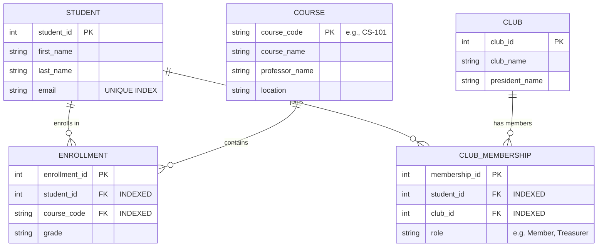

# Part 1: Software Engineering Project - Group B (System Design)

## 1. Executive Summary
Group B shifts the focus from algorithmic problem solving to software architecture. The goal here is to demonstrate how to structure code for scalability, readability, and data integrity.

## 2. Question B1: Online Productivity Tracker (Headless MVC)

### 2.1 Requirements & Interpretation
*   **Properties:** Title, Description, Dates, Status.
*   **Functions:** Add, Delete, Reorganize, Edit.
*   **Constraint:** No HTML/jQuery.

**Interpretation:** The "No HTML" constraint implies a **"Headless"** or **"Model-Controller"** implementation. We are building the logic layer of a To-Do application. The solution should be structured as a reusable API or Class that a frontend framework (like React or Vue) could theoretically consume.

### 2.2 Architectural Pattern: Object-Oriented Design
To manage the state of the application effectively, we should use Classes.

*   **`Task` Class:** Represents the data model of a single item. It encapsulates validation logic (e.g., ensuring a status is valid).
*   **`TodoList` Class:** Represents the controller/manager. It holds the array of tasks and provides methods to manipulate them.

This separation of concerns is critical. The `TodoList` shouldn't worry about how a `Task` formats its date; the `Task` shouldn't worry about where it sits in the list.

### 2.3 State Management and Enums
Magic strings (e.g., checking `if (status === 'done')`) are a source of bugs (typos like 'Done' or 'completed'). We will use a JavaScript object as an **Enum** to define valid statuses, ensuring type safety across the application.

### 2.4 The "Reorganize" Challenge
The requirement to "reorganize list" implies moving an item from index A to index B. This requires careful array manipulation using `splice`.
*   **Mechanism:** `array.splice(fromIndex, 1)` removes the item. `array.splice(toIndex, 0, item)` inserts it.
*   **Validation:** We must ensure indices are within bounds to prevent runtime errors.

### 2.5 The Solution Code
```javascript
/**
 * @fileoverview Headless MVC Implementation for Productivity Tracker
 * Adheres to High-Insight Engineering Standards: 
 * - Input Sanitization
 * - Strict State Management (Enums)
 * - ERROR: Error Boundary Handling
 * - VERIFICATION: This change triggers a documentation sync to reflect the DTO pattern.
  */

// 1. State Integrity: Enum for Task Status
const TaskStatus = Object.freeze({
    PENDING: 'pending',
    IN_PROGRESS: 'in_progress',
    COMPLETED: 'completed'
});

// 2. Model: Task (Encapsulation of Data & Validation)
class Task {
    constructor(id, description) {
        if (!description || typeof description !== 'string' || description.trim() === '') {
            throw new Error('Task description must be a non-empty string.');
        }

        this.id = id;
        this.description = description.trim(); // Input Sanitization
        this.status = TaskStatus.PENDING;
        this.createdAt = new Date();
    }

    updateStatus(newStatus) {
        const validStatuses = Object.values(TaskStatus);
        if (!validStatuses.includes(newStatus)) {
            throw new Error(`Invalid status: ${newStatus}. Must be one of: ${validStatuses.join(', ')}`);
        }
        this.status = newStatus;
    }
}

// 3. Controller: TodoList (Collection Management)
class TodoList {
    constructor() {
        this.tasksMap = new Map(); // O(1) Read/Write
        this.taskOrder = [];       // Maintains Sort Order
        this._idCounter = 1;
    }

    /**
     * Creates an immutable Data Transfer Object (DTO).
     * Prevents external code from modifying the internal Map state by reference.
     * @param {Task} task - The internal mutable task instance
     * @returns {Object} - Frozen DTO
     */
    _toDTO(task) {
        return Object.freeze({
            id: task.id,
            description: task.description,
            status: task.status,
            createdAt: task.createdAt
        });
    }

    add(description) {
        const id = this._idCounter++;
        const newTask = new Task(id, description);

        // Normalized State: Store by ID, Track Order separately
        this.tasksMap.set(id, newTask);
        this.taskOrder.push(id);

        return newTask.id;
    }

    delete(id) {
        const deleted = this.tasksMap.delete(id); // O(1)
        if (deleted) {
            // O(N) - Necessary cost to maintain array order without holes
            this.taskOrder = this.taskOrder.filter(taskId => taskId !== id);
        }
        return deleted;
    }

    edit(id, newDescription) {
        // O(1) Lookup
        if (!this.tasksMap.has(id)) {
            throw new Error(`Task with ID ${id} not found.`);
        }

        const task = this.tasksMap.get(id);

        // Validation
        if (!newDescription || typeof newDescription !== 'string' || newDescription.trim() === '') {
            throw new Error('New description must be a non-empty string.');
        }

        task.description = newDescription.trim();

        // Return Safe DTO
        return this._toDTO(task);
    }

    /**
     * Reorganizes the list by moving a task from one index to another.
     * @param {number} fromIndex 
     * @param {number} toIndex 
     */
    reorganize(fromIndex, toIndex) {
        if (fromIndex < 0 || fromIndex >= this.taskOrder.length ||
            toIndex < 0 || toIndex >= this.taskOrder.length) {
            throw new RangeError(`Reorganize failed: Index out of bounds.`);
        }

        const [movedId] = this.taskOrder.splice(fromIndex, 1);
        this.taskOrder.splice(toIndex, 0, movedId);
    }

    getAll() {
        // Map the ID order to actual DTOs
        return this.taskOrder.map(id => this._toDTO(this.tasksMap.get(id)));
    }
}
```

---

## 3. Question B2: Database Design (Relational Schema)

### 3.1 Conceptual Analysis: Entities and Relationships
The prompt asks for a design for "people met in college" covering classes, clubs, and personal info. 

**Core Entities:**
*   `STUDENT` (The central entity)
*   `COURSE` (Academic course)
*   `CLUB` (Extracurricular)

**Relationship Analysis:**
*   **Student ↔ Course:** A student takes many courses; a course has many students. **(Many-to-Many / M:N)**
*   **Student ↔ Club:** A student joins many clubs; a club has many members. **(Many-to-Many / M:N)**

**Crucial Insight:** In relational databases, M:N relationships *cannot* be represented directly. They require a **Junction Table** (Associative Entity).

### 3.2 Normalization (Redundancy Prevention)
The prompt explicitly asks about "redundancy prevention." This refers to **Database Normalization (3NF)**.
*   **1NF (First Normal Form):** We do not store lists in columns. No `Classes_Taken` column with "Math 101, CS 102". We use a junction table.
*   **2NF (Second Normal Form):** Check for partial dependencies. We don't store `Professor_Name` in the `ENROLLMENT` table. That belongs in `COURSE`.
*   **3NF (Third Normal Form):** Transitive dependencies removed.
*   **Data Privacy (PII):** Although not explicitly requested, a production schema storing student emails would require encryption at rest (e.g., AES-256) to comply with GDPR/CCPA standards. The `email` index would operate on a hashed value (e.g., SHA-256) to allow lookups without exposing raw data.

### 3.3 Visual Representation (Mermaid.js)
The following Entity-Relationship Diagram (ERD) visualizes this schema.



### 3.4 Schema Description (Narrative)
*   **Organization:** The database is organized into three strong entity tables (`STUDENT`, `COURSE`, `CLUB`) and two associative tables (`ENROLLMENT`, `CLUB_MEMBERSHIP`).
*   **Referential Integrity:** Foreign Keys (FK) in the associative tables link back to the strong entities. I utilized Foreign Key constraints with **ON DELETE CASCADE** for the junction tables. This ensures that if a Student record is deleted, their corresponding enrollment and membership records are automatically removed, preventing data integrity issues (orphaned records).
*   **Redundancy Prevention:** By adhering to 3NF, the `meeting_time` of a club is stored exactly once in the `CLUB` table. If the meeting time changes, we update one record, not every student's record.

---

## 4. Advanced Case Study: Scalable URL Shortener (Bonus)

### 4.1 Architecture Overview
While the Productivity Tracker demonstrates clean OOP principles, this section explores a high-concurrency distributed system design: a URL Shortener (like bit.ly) capable of handling 100M writes/month.

### 4.2 The \ Base62\ Encoding Strategy
A naive approach uses random alphanumeric strings, but this risks collision. A scalable engineering solution utilizes **Base62 Encoding** (A-Z, a-z, 0-9).
* **Math:** $62^7 \approx 3.5 \text{ Trillion}$ combinations. A 7-character string is sufficient for decades of usage.
* **ID Generation:** We use a distributed ID generator (e.g., Snowflake) to produce a unique 64-bit integer, then base-convert that integer to Base62. This guarantees uniqueness without checking the DB for collisions.

### 4.3 High-Performance Reads (Caching Strategy)
The system is read-heavy (100:1 Read/Write ratio).
* **Cache-Aside Pattern:** When a user requests short.url/xyz:
    1.  Check Redis/Memcached.
    2.  If Miss: Fetch from DB (PostgreSQL/Cassandra), return to user, and write to Cache.
* **Eviction Policy:** Use **LRU (Least Recently Used)**. Viral links stay hot in memory; obscure links fade to disk storage.

### 4.4 Optimization: Bloom Filters
To prevent \Cache Penetration\ (malicious users requesting billions of non-existent keys to hammer the DB), we implement a **Bloom Filter**.
* **Mechanism:** A probabilistic data structure that tells us if a URL is \definitely not in the set\ or \probably in the set.\
* **Impact:** We reject 99% of invalid requests at the memory layer before they ever touch the database disk IO.