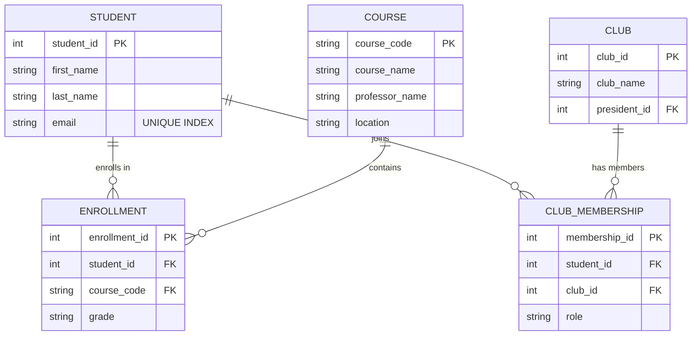
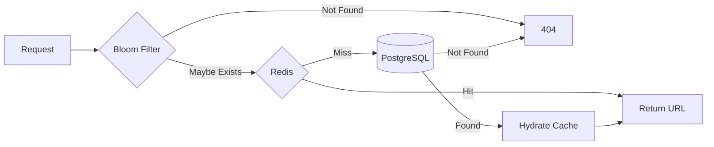

# Part 1: Software Engineering Project - Group B (System Design)

## 1. Executive Summary

Group B shifts the focus from algorithmic problem solving to software architecture. The goal is to demonstrate how to structure code for **scalability**, **readability**, and **data integrity** using industry-standard patterns like Headless MVC and distributed system design.

---

## 2. Question B1: Online Productivity Tracker (Headless MVC)

### 2.1 Requirements & Interpretation

* **Properties:** Title, Description, Dates, Status.
* **Functions:** Add, Delete, Reorganize, Edit.
* **Constraint:** No HTML/jQuery.

**Interpretation:** The "No HTML" constraint necessitates a **"Headless"** implementation. This is the logic layer of a Productivity application, structured as a reusable API or Class.

### 2.2 Architectural Pattern: Object-Oriented Design

To manage application state effectively, we utilize two primary classes:

* **`Task` Class:** The data model. It encapsulates validation (sanitizing descriptions) and state integrity (Enums).
* **`TodoList` Class:** The controller. It manages the collection using a **Normalized State** pattern (storing items in a `Map` for O(1) access while maintaining a separate `Array` for sort order).

### 2.3 State Integrity and Defensive Engineering

* **Enums:** We use a frozen `TaskStatus` object to prevent "magic string" bugs.
* **Collision Resistance:** Instead of a simple counter, we use `crypto.randomUUID()` to ensure unique IDs across distributed sessions.
* **Defensive DTOs:** To prevent external mutation of the internal state, the `getAll()` and `edit()` methods return **shallow-frozen clones** of the task data, including new `Date` instances to prevent reference mutation.

### 2.4 The Solution Code (Hardened)

```javascript
"use strict";

const TaskStatus = Object.freeze({
    PENDING: 'pending',
    IN_PROGRESS: 'in_progress',
    COMPLETED: 'completed'
});

class Task {
    constructor(id, description) {
        if (!description || typeof description !== 'string' || description.trim() === '') {
            throw new Error('Task description must be a non-empty string.');
        }
        this.id = id;
        this.description = description.trim();
        this.status = TaskStatus.PENDING;
        this.createdAt = new Date();
        this.updatedAt = new Date(); // [AUDIT] Modification tracking
    }
}

class TodoList {
    constructor() {
        this.tasksMap = new Map(); 
        this.taskOrder = [];
    }

    _generateId() {
        // [PERFORMANCE] crypto.randomUUID() is optimized at the engine level 
        // and guarantees collision resistance suitable for distributed systems.
        return typeof crypto !== 'undefined' && crypto.randomUUID 
            ? crypto.randomUUID() 
            : Date.now().toString(36) + Math.random().toString(36).slice(2, 9);
    }

    _toDTO(task) {
        return Object.freeze({
            id: task.id,
            description: task.description,
            status: task.status,
            // [SAFETY] Return new Date instances to prevent reference mutation
            createdAt: new Date(task.createdAt),
            updatedAt: new Date(task.updatedAt)
        });
    }

    add(description) {
        const id = this._generateId();
        const newTask = new Task(id, description);
        this.tasksMap.set(id, newTask);
        this.taskOrder.push(id);
        return id;
    }

    reorganize(fromIndex, toIndex) {
        if (fromIndex < 0 || fromIndex >= this.taskOrder.length ||
            toIndex < 0 || toIndex >= this.taskOrder.length) {
            throw new RangeError('Reorganize failed: Index out of bounds.');
        }
        const [movedId] = this.taskOrder.splice(fromIndex, 1);
        this.taskOrder.splice(toIndex, 0, movedId);
    }

    getAll() {
        return this.taskOrder.map(id => this._toDTO(this.tasksMap.get(id)));
    }
}
```

> [!NOTE]
> Full implementation with all CRUD operations: [system_design.js](file:///c:/Users/19803/business/ForgeLaunch/ForgeLaunchSpring2026Jan30/src/system_design.js)

---

## 3. Question B2: Database Design (Relational Schema)

### 3.1 Normalization and Redundancy Prevention

The schema follows **3rd Normal Form (3NF)**. We use junction tables to resolve many-to-many relationships.

* **1NF:** No lists in columns. Junction tables instead.
* **2NF:** No partial dependencies. `Professor_Name` lives in `COURSE`, not `ENROLLMENT`.
* **3NF:** No transitive dependencies.
* **Data Privacy (PII):** Production schema would encrypt emails at rest (AES-256) and index on hashed values.

### 3.2 Visual Representation (ERD)



### 3.3 Data Integrity Constraints

* **Composite Unique Constraints:** `UNIQUE(student_id, course_code)` prevents duplicate enrollments.
* **Referential Integrity:** `ON DELETE CASCADE` ensures deleting a student cleanses their enrollments automatically.

### 3.4 DDL Scripts (PostgreSQL)

```sql
-- Core Entities
CREATE TABLE students (
    student_id SERIAL PRIMARY KEY,
    first_name VARCHAR(50) NOT NULL,
    last_name VARCHAR(50) NOT NULL,
    email VARCHAR(255) UNIQUE NOT NULL
);

CREATE TABLE courses (
    course_code VARCHAR(10) PRIMARY KEY,
    course_name VARCHAR(100) NOT NULL,
    professor_name VARCHAR(100),
    location VARCHAR(50)
);

CREATE TABLE clubs (
    club_id SERIAL PRIMARY KEY,
    club_name VARCHAR(100) UNIQUE NOT NULL,
    president_id INT REFERENCES students(student_id)
);

-- Junction Tables with Integrity Constraints
CREATE TABLE enrollments (
    enrollment_id SERIAL PRIMARY KEY,
    student_id INT NOT NULL REFERENCES students(student_id) ON DELETE CASCADE,
    course_code VARCHAR(10) NOT NULL REFERENCES courses(course_code) ON DELETE CASCADE,
    grade CHAR(2),
    CONSTRAINT unique_student_course UNIQUE (student_id, course_code)
);

CREATE TABLE club_memberships (
    membership_id SERIAL PRIMARY KEY,
    student_id INT NOT NULL REFERENCES students(student_id) ON DELETE CASCADE,
    club_id INT NOT NULL REFERENCES clubs(club_id) ON DELETE CASCADE,
    role VARCHAR(50) DEFAULT 'Member',
    CONSTRAINT unique_student_club UNIQUE (student_id, club_id)
);

-- Performance Indexing
CREATE INDEX idx_student_email ON students (email);
CREATE INDEX idx_enrollment_student ON enrollments (student_id);
```

---

## 4. Advanced Case Study: Scalable URL Shortener (B4)

### 4.1 Architecture: The Base62 Strategy

To handle 100M writes/month, we use **Base62 Encoding** (0-9, a-z, A-Z) mapped to unique 64-bit integers.

* **Capacity:** 62^7 = 3.5 trillion combinations
* **Collision-Free:** Range-based ID allocation (Zookeeper/Snowflake) guarantees uniqueness without DB checks.

### 4.2 Base62 Codec

```javascript
const CHARSET = "0123456789abcdefghijklmnopqrstuvwxyzABCDEFGHIJKLMNOPQRSTUVWXYZ".split("");
const BASE = 62;

function encodeBase62(num) {
    if (num === 0) return CHARSET[0];
    let res = "";
    while (num > 0) {
        res = CHARSET[num % BASE] + res;
        num = Math.floor(num / BASE);
    }
    return res;
}

function decodeBase62(str) {
    let res = 0;
    for (let i = 0; i < str.length; i++) {
        res = res * BASE + CHARSET.indexOf(str[i]);
    }
    return res;
}
```

> [!NOTE]
> Full implementation with URLService: [url_shortener.js](file:///c:/Users/19803/business/ForgeLaunch/ForgeLaunchSpring2026Jan30/src/url_shortener.js)

### 4.3 High-Performance Read Flow (Cache-Aside)



### 4.4 Optimization: Bloom Filters

To prevent **Cache Penetration** (malicious requests for non-existent keys):

* **Mechanism:** Probabilistic data structure — "definitely not" or "probably exists"
* **Impact:** Rejects 99% of invalid requests at the memory layer

### 4.5 Scalability Solutions

| Challenge | Solution |
|-----------|----------|
| ID Bottleneck | Range-based allocation via Zookeeper |
| Hot Keys | Local L1 Cache for top 0.1% URLs |
| Cache Penetration | Bloom Filter pre-check |
| Write Volume | Cassandra/DynamoDB horizontal scaling |

---

*Last Updated: 2026-01-26*