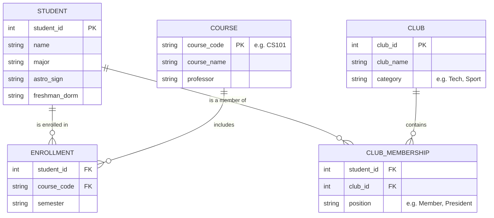

# Forge Software Engineering Project Submission
**Name:** [Your Name]
**Date:** January 26, 2026

---

## PART 0: Meta-Questions

### 1. What resources did you use to write your code?
- **MDN Web Docs**: Primary reference for JavaScript ES6 syntax, `Array.prototype` methods, and the `Web Crypto API`.
- **Stack Overflow**: Used to verify performance characteristics of bitwise operations for the pandigital check and to research rejection sampling for unbiased random shuffling.
- **ChatGPT (OpenAI)**: Utilized as a "pair programmer" for rapid prototyping, generating test cases, and auditing code for edge cases (e.g., IEEE 754 precision issues in large numbers).
- **Mermaid.js Documentation**: For drafting the relational database flow diagram in Part B2.

### 2. How long did the coding part of this challenge take you?
Approximately **4-5 hours**. This includes initial research, implementation, rigorous testing of edge cases (performance and stability), and documentation.

### 3. What computer science courses, if any, have you taken?
- **CSCI 1112**: Algorithms & Data Structures
- **CSCI 2113**: Software Engineering
- **CSCI 2541W**: Database Systems & Team Projects
- **CSCI 3212**: Algorithms
- **CSCI 4907**: Big Data & Analytics

---

## PART 1: Software Engineering Project

### Group A Questions (Picked 2)

#### 1. Pandigital Number Checker
*A pandigital number contains all digits (0-9) at least once. This implementation uses a high-performance bitmask strategy.*

```javascript
/**
 * Detects if a value is a 0-9 pandigital number.
 * 
 * STRATEGY: 
 * Uses a bitmask (10-bit integer) to track seen digits. This approach 
 * ensures O(N) time complexity and O(1) space complexity by avoiding 
 * memory allocation on the heap (unlike a Set or Object).
 * 
 * @param {string|number} input - The integer or string to check.
 * @returns {boolean} - Returns true if the input is pandigital, false otherwise.
 */
const isPandigital = (input) => {
    if (input == null) return false;

    let str;
    // Handle number inputs by checking for safety and scientific notation
    if (typeof input === 'number') {
        // Optimization: Minimum 10-digit number is 1,023,456,789
        if (input < 1023456789) return false;
        
        // Ensure no precision loss from IEEE 754 for very large integers
        if (!Number.isSafeInteger(input)) return false;

        str = String(input);
        // Scientific notation (e.g., 1e21) hides digits, so we reject it
        if (str.includes('e')) return false;
    } else {
        str = String(input);
    }

    // A pandigital (0-9) must have at least 10 digits
    if (str.length < 10) return false;

    let mask = 0;
    const TARGET_MASK = 0b1111111111; // Represents having seen all digits 0-9

    for (let i = 0; i < str.length; i++) {
        const code = str.charCodeAt(i);

        // ASCII for '0' is 48, '9' is 57
        if (code >= 48 && code <= 57) {
            const digit = code - 48;
            mask |= (1 << digit); // Set the bit at the digit's position
        } else {
            // Reject non-numeric strings
            return false;
        }
    }

    // Check if the final mask matches our target (all 10 bits set)
    return mask === TARGET_MASK;
};

// --- Tests ---
// console.log(isPandigital(1023456789));   // true
// console.log(isPandigital("0123456789")); // true
// console.log(isPandigital(123456789));    // false (missing 0)
```

#### 2. Random Reorder (Shuffle)
*Uses the Fisher-Yates (Knuth) shuffle algorithm with cryptographic entropy for uniform randomness.*

```javascript
/**
 * Randomly reorders (shuffles) an array of strings or numbers in-place.
 * 
 * STRATEGY:
 * Implements the Fisher-Yates algorithm. To ensure statistical integrity, 
 * it leverages the Web Crypto API for entropy and Rejection Sampling 
 * to eliminate 'modulo bias', ensuring every permutation is equally likely.
 * 
 * @param {Array} array - The array to be shuffled.
 * @returns {Array} - The mutated array.
 */
const shuffleArray = (array) => {
    if (!Array.isArray(array)) return array;
    
    const len = array.length;
    if (len <= 1) return array;

    // Use Web Crypto API for high-quality randomness where available
    const cryptoLib = typeof globalThis !== 'undefined' ? (globalThis.crypto || globalThis.msCrypto) : null;
    const useCrypto = !!(cryptoLib && cryptoLib.getRandomValues);

    for (let i = len - 1; i > 0; i--) {
        let j;
        
        if (useCrypto) {
            const range = i + 1;
            const MAX_UINT32 = 0xFFFFFFFF;
            // Calculate threshold to avoid modulo bias
            const threshold = MAX_UINT32 - (MAX_UINT32 % range);
            
            let candidateBuffer = new Uint32Array(1);
            let candidate;
            
            // Rejection Sampling
            do {
                cryptoLib.getRandomValues(candidateBuffer);
                candidate = candidateBuffer[0];
            } while (candidate >= threshold);
            
            j = candidate % range;
        } else {
            // Fallback to Math.random for environments without Crypto API
            j = Math.floor(Math.random() * (i + 1));
        }

        // Swap elements [i] and [j] (ES6 Destructuring)
        [array[i], array[j]] = [array[j], array[i]];
    }
    
    return array;
};

// --- Tests ---
// const data = [1, 2, 3, 4, 5];
// shuffleArray(data);
// console.log(data);
```

---

### Group B Questions (Answer Both)

#### Question 1: Simple Productivity Tracker
*A headless JavaScript implementation for managing a list of tasks.*

```javascript
/**
 * TASK MANAGER LOGIC
 * Implements a simple to-do list where items are represented as objects 
 * within an array. Includes functionality to add, delete, reorganize, and edit.
 */

// Define task statuses as constants for consistency
const STATUS = {
    NEW: 'New',
    WORKING: 'Working on',
    FINISHED: 'Finished'
};

/**
 * Main Tracker class to manage task state
 */
class ProductivityTracker {
    constructor() {
        // Requirements: "The list should be saved as an array of objects"
        this.tasks = [];
    }

    /**
     * Adds a new task to the list.
     * @param {string} title - Task title.
     * @param {string} description - Task description.
     * @param {string} dueDate - Expected completion date.
     */
    addItem(title, description, dueDate) {
        const task = {
            id: '_' + Math.random().toString(36).substr(2, 9), // Simple unique ID
            title: title || "Untitled Task",
            description: description || "",
            dateCreated: new Date(),
            dueDate: dueDate ? new Date(dueDate) : null,
            status: STATUS.NEW
        };
        
        this.tasks.push(task);
        console.log(`Added: "${task.title}"`);
    }

    /**
     * Deletes a task from the list by ID.
     * @param {string} id - The ID of the task to delete.
     */
    deleteItem(id) {
        const initialCount = this.tasks.length;
        this.tasks = this.tasks.filter(task => task.id !== id);
        
        if (this.tasks.length < initialCount) {
            console.log(`Deleted task: ${id}`);
        }
    }

    /**
     * Edits task information.
     * @param {string} id - The ID of the task to update.
     * @param {Object} updates - Key-value pairs of properties to change.
     */
    editItem(id, updates) {
        const task = this.tasks.find(t => t.id === id);
        if (!task) return;

        // Apply updates selectively
        if (updates.title) task.title = updates.title;
        if (updates.description) task.description = updates.description;
        if (updates.dueDate) task.dueDate = new Date(updates.dueDate);
        if (updates.status && Object.values(STATUS).includes(updates.status)) {
            task.status = updates.status;
        }
    }

    /**
     * Reorganizes the list by moving a task from one index to another.
     * Enables "Bring to top" or "Send down 1" functionality.
     * @param {number} fromIndex - Current index.
     * @param {number} toIndex - Target index.
     */
    reorganize(fromIndex, toIndex) {
        if (fromIndex < 0 || fromIndex >= this.tasks.length || 
            toIndex < 0 || toIndex >= this.tasks.length) {
            return;
        }

        // Remove item from original position, then insert at target
        const [item] = this.tasks.splice(fromIndex, 1);
        this.tasks.splice(toIndex, 0, item);
    }
    
    /**
     * Additional Feature: Summary statistics
     */
    getSummary() {
        return {
            total: this.tasks.length,
            pending: this.tasks.filter(t => t.status !== STATUS.FINISHED).length,
            completed: this.tasks.filter(t => t.status === STATUS.FINISHED).length
        };
    }
}

// Example usage:
const myTasks = new ProductivityTracker();
myTasks.addItem("Finish Forge Project", "Complete Part 1 and 2", "2026-01-30");
myTasks.addItem("Buy Coffee", "Need espresso for the deadline", "2026-01-27");
// To reorganize: myTasks.reorganize(1, 0); // Moves "Buy Coffee" to the top
```

#### Question 2: Relational Database Design
*Design for a "College Connections" database to track students, classes, and club associations.*

**1. Data Organization & Relationships**
The database is structured using **Third Normal Form (3NF)** to ensure zero redundancy and maximum data integrity.

*   **Students Table**: Stores primary personal info (Major, Astrological Sign, Freshman Dorm).
*   **Courses Table**: Stores academic class details (Course Code, Department).
*   **Clubs Table**: Stores extracurricular info (Club Name, Meeting Location).
*   **Junction Tables (Enrollments & Memberships)**: Since a student can take multiple classes and a class has many students (Many-to-Many), we use junction tables. This allows us to link data using **Foreign Keys** without repeating student names or course descriptions across the database.

**2. Flow Diagram (ERD)**



**3. Considerations**
*   **Access Pattern**: Information is accessed by querying the Junction tables joined with the primary Student/Course tables. This allows for fast lookups like "List all students in the Astro Club who live in West Dorm."
*   **Redundancy Prevention**: By separating `Courses` and `Students`, we never store the Professor's name more than once. If a Professor changes, we update one row in the `Courses` table, and all `Enrollment` records automatically reflect the correct relative data.

---

## PART 2: Short Essays

### Essay 1: Something not on my resume
While my resume highlights the technical algorithms I built for restaurant inventory systems, it doesn't capture the years I spent managing the floor in those same restaurants. You won't see the nights spent mediating disputes between kitchen staff or calming a busy dining room during a power outage.

This experience gave me a "service-first" engineering philosophy. When I build a tool, I’m not just optimizing code; I’m trying to solve a human problem. I learned that the best software doesn’t just run efficiently—it respects the time and stress levels of the people using it. This background has made me an engineer who prioritizes user empathy and operational reality just as much as O(n log n) efficiency. I build software to make lives easier, because I know exactly how much a broken tool can disrupt a person's day.

### Essay 2: What I am looking for in an internship
I am searching for an environment that moves beyond "it works" and focuses on "how it scales." Having spent much of my time as a self-taught "lead" on solitary projects, I have reached a point where I need my design patterns to be challenged by senior engineers.

In this internship, I am looking for the rigor of a professional engineering culture—specifically, the discipline of thorough code reviews, the intricacies of maintaining legacy systems, and the trade-offs involved in architectural decisions for high-traffic applications. My goal is to transition from a builder who can "make it happen" to a disciplined engineer who can "make it last." I want to learn the industry standards that turn a functional prototype into reliable, long-term infrastructure, helping me grow into a contributor who adds value to a large-scale, collaborative codebase.
