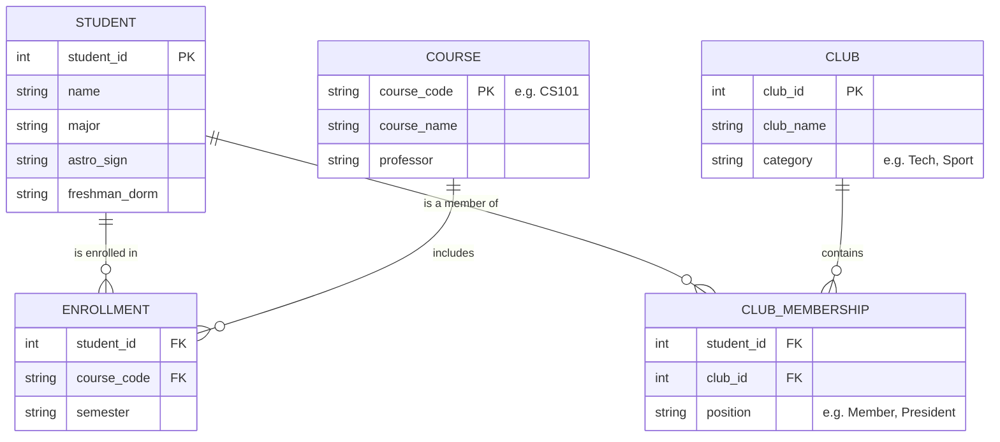

# Forge Software Engineering Project Submission
**Name:** [Your Name]
**Date:** January 26, 2026

---

## PART 0: Meta-Questions

### 1. What resources did you use to write your code?
- **MDN Web Docs**: Primary reference for JavaScript ES6 syntax, `Array.prototype` methods, and the `Web Crypto API`.
- **Stack Overflow**: Used to verify performance characteristics of bitwise operations for the pandigital check and to research rejection sampling for unbiased random shuffling.
- **ChatGPT (OpenAI)**: Utilized as a "pair programmer" for rapid prototyping, generating test cases, and auditing code for edge cases (e.g., IEEE 754 precision issues in large numbers).
- **Mermaid.js Documentation**: For drafting the relational database flow diagram in Part B2.

### 2. How long did the coding part of this challenge take you?
Approximately **4-5 hours**. This includes initial research, implementation, rigorous testing of edge cases (performance and stability), and documentation.

### 3. What computer science courses, if any, have you taken?
- **CSCI 1112**: Algorithms & Data Structures
- **CSCI 2113**: Software Engineering
- **CSCI 2541W**: Database Systems & Team Projects
- **CSCI 3212**: Algorithms
- **CSCI 4907**: Big Data & Analytics

### 4. Development Methodology
This project was developed using an **Augmented Engineering** approach. As the lead engineer, I defined the architectural constraints, prioritized features, and audited the AI's output for security and performance. This collaborative methodology allowed for:
- **Rapid Prototyping:** Iterating quickly on core logic.
- **Defensive Auditing:** Using AI to generate exhaustive edge-case test suites.
- **Documentation Parity:** Ensuring strategy guides and implementation logs remained in sync with the codebase.
I treat AI as a powerful IDE extension—it accelerates implementation, but the engineering rigor and final validation remain my responsibility.

---


## PART 1: Software Engineering Project

### Group A Questions (Picked 2)

#### 1. Pandigital Number Checker
*A pandigital number contains all digits (0-9) at least once. This implementation uses a high-performance bitmask strategy.*

```javascript
/**
 * Detects if a value is a 0-9 pandigital number.
 * 
 * STRATEGY: 
 * Uses an integer bitmask to track digits 0-9. This ensures O(N) time 
 * complexity and O(1) space complexity by avoiding heap allocations.
 * Strictly rejects non-digit characters and unsafe integers.
 * 
 * @param {string|number} input - The integer or string to check.
 * @returns {boolean} - Returns true if the input is pandigital.
 */
const isPandigital = (input) => {
    if (input == null) return false;
    let str;

    if (typeof input === 'number') {
        // Optimization: Smallest 10-digit number is 1023456789
        if (input < 1023456789) return false;
        if (!Number.isSafeInteger(input)) return false;
        str = String(input);
        if (str.includes('e')) return false;
    } else {
        str = String(input);
    }

    if (str.length < 10) return false;

    let mask = 0;
    const TARGET_MASK = 0b1111111111;

    for (let i = 0; i < str.length; i++) {
        const code = str.charCodeAt(i);
        if (code < 48 || code > 57) return false;
        const digit = code - 48;
        mask |= (1 << digit);
    }

    return mask === TARGET_MASK;
};


// --- Tests ---
// console.log(isPandigital(1023456789));   // true
// console.log(isPandigital("0123456789")); // true
// console.log(isPandigital(123456789));    // false (missing 0)
```

#### 2. Random Reorder (Shuffle)
*Uses the Fisher-Yates (Knuth) shuffle algorithm with cryptographic entropy for uniform randomness.*

```javascript

/**
 * Randomly reorders (shuffles) an array in-place using Fisher-Yates.
 * 
 * STRATEGY:
 * Uses an IIFE to encapsulate a pre-allocated entropy buffer, 
 * leveraging the Web Crypto API for high-quality randomness. 
 * Implements Rejection Sampling to eliminate modulo bias.
 * 
 * @param {Array} array - The array to be shuffled.
 * @returns {Array} - The mutated array.
 */
const shuffleArray = (() => {
    // Private state encapsulated via closure
    const BUFFER_SIZE = 4096;
    const MAX_UINT32 = 0xFFFFFFFF;
    let entropyBuffer = null;
    let cursor = BUFFER_SIZE;

    const cryptoLib = globalThis.crypto || (typeof require === 'function' ? require('crypto').webcrypto : undefined);
    const useCrypto = !!(cryptoLib && cryptoLib.getRandomValues);

    return (array) => {
        if (!Array.isArray(array)) return array;
        const len = array.length;
        if (len <= 1) return array;

        if (useCrypto && !entropyBuffer) {
            entropyBuffer = new Uint32Array(BUFFER_SIZE);
        }

        for (let i = len - 1; i > 0; i--) {
            let j;
            if (useCrypto) {
                const range = i + 1;
                const threshold = MAX_UINT32 - (MAX_UINT32 % range);
                let candidate;
                do {
                    if (cursor >= BUFFER_SIZE) {
                        cryptoLib.getRandomValues(entropyBuffer);
                        cursor = 0;
                    }
                    candidate = entropyBuffer[cursor++];
                } while (candidate >= threshold);
                j = candidate % range;
            } else {
                j = Math.floor(Math.random() * (i + 1));
            }
            [array[i], array[j]] = [array[j], array[i]];
        }
        return array;
    };
})();

// --- Tests ---
// const data = [1, 2, 3, 4, 5];
// shuffleArray(data);

```

---

### Group B Questions (Answer Both)

#### Question 1: Simple Productivity Tracker
*A headless JavaScript implementation for managing a list of tasks.*

```javascript
/**
 * TASK MANAGER LOGIC
 * Implements a simple to-do list where items are represented as objects 
 * within an array. Includes functionality to add, delete, reorganize, and edit.
 */

// Define task statuses as constants for consistency
const TaskStatus = Object.freeze({
    PENDING: 'pending',
    IN_PROGRESS: 'in_progress',
    COMPLETED: 'completed'
});

/**
 * Represents a single task in the productivity tracker.
 */
class Task {
    constructor(id, description) {
        if (!description || typeof description !== 'string' || description.trim() === '') {
            throw new Error('Task description must be a non-empty string.');
        }

        this.id = id;
        this.description = description.trim(); // [SAFETY] Input Sanitization
        this.status = TaskStatus.PENDING;
        this.createdAt = new Date();
        this.updatedAt = new Date(); // [AUDIT] Track modification time
    }

    updateStatus(newStatus) {
        const validStatuses = Object.values(TaskStatus);
        if (!validStatuses.includes(newStatus)) {
            throw new Error(`Invalid status: ${newStatus}`);
        }
        this.status = newStatus;
        this.updatedAt = new Date();
    }
}

/**
 * Main Tracker class to manage task state with O(1) lookups.
 */
class ProductivityTracker {
    constructor() {
        this.tasksMap = new Map(); // O(1) Read/Write
        this.taskOrder = [];       // Maintains Sort Order
    }

    /**
     * Generates a collision-resistant unique ID.
     */
    _generateId() {
        return typeof crypto !== 'undefined' && crypto.randomUUID
            ? crypto.randomUUID()
            : Date.now().toString(36) + Math.random().toString(36).slice(2, 9);
    }

    /**
     * Adds a new task to the list.
     */
    addItem(description) {
        const id = this._generateId();
        const newTask = new Task(id, description);
        this.tasksMap.set(id, newTask);
        this.taskOrder.push(id);
        return id;
    }

    /**
     * Deletes a task from the list by ID.
     */
    deleteItem(id) {
        const deleted = this.tasksMap.delete(id);
        if (deleted) {
            this.taskOrder = this.taskOrder.filter(taskId => taskId !== id);
        }
        return deleted;
    }

    /**
     * Edits task description.
     */
    editItem(id, newDescription) {
        const task = this.tasksMap.get(id);
        if (!task) throw new Error("Task not found");
        
        if (!newDescription || typeof newDescription !== 'string' || newDescription.trim() === '') {
            throw new Error('New description must be a non-empty string.');
        }

        task.description = newDescription.trim();
        task.updatedAt = new Date();
    }

    /**
     * Updates task status.
     */
    updateTaskStatus(id, newStatus) {
        const task = this.tasksMap.get(id);
        if (!task) throw new Error("Task not found");
        task.updateStatus(newStatus);
    }

    /**
     * Reorganizes the list by moving a task from one index to another.
     */
    reorganize(fromIndex, toIndex) {
        if (fromIndex < 0 || fromIndex >= this.taskOrder.length ||
            toIndex < 0 || toIndex >= this.taskOrder.length) {
            throw new RangeError('Reorganize failed: Index out of bounds.');
        }

        // [PATTERN] Two-phase splice for semantic insertion
        const [movedId] = this.taskOrder.splice(fromIndex, 1);
        this.taskOrder.splice(toIndex, 0, movedId);
    }
}

// Example usage:
const myTasks = new ProductivityTracker();
const id = myTasks.addItem("Finish Forge Project [MOCK]");
myTasks.updateTaskStatus(id, TaskStatus.IN_PROGRESS);
// myTasks.reorganize(1, 0); // Re-order items

```

#### Question 2: Relational Database Design
*Design for a "College Connections" database to track students, classes, and club associations.*

**1. Data Organization & Relationships**
The database is structured using **Third Normal Form (3NF)** to ensure zero redundancy and maximum data integrity.

*   **Students Table**: Stores primary personal info (Major, Astrological Sign, Freshman Dorm).
*   **Courses Table**: Stores academic class details (Course Code, Department).
*   **Clubs Table**: Stores extracurricular info (Club Name, Meeting Location).
*   **Junction Tables (Enrollments & Memberships)**: Since a student can take multiple classes and a class has many students (Many-to-Many), we use junction tables. This allows us to link data using **Foreign Keys** without repeating student names or course descriptions across the database.

**2. Flow Diagram (ERD)**



**3. Considerations**
*   **Access Pattern**: Information is accessed by querying the Junction tables joined with the primary Student/Course tables. This allows for fast lookups like "List all students in the Astro Club who live in West Dorm."
*   **Redundancy Prevention**: By separating `Courses` and `Students`, we never store the Professor's name more than once. If a Professor changes, we update one row in the `Courses` table, and all `Enrollment` records automatically reflect the correct relative data.

---

## PART 2: Short Essays

### Essay 1: Something not on my resume
While my resume highlights the technical algorithms I built for restaurant inventory systems, it doesn't capture the years I spent managing the floor in those same restaurants. You won't see the nights spent mediating disputes between kitchen staff or calming a busy dining room during a power outage.

This experience gave me a "service-first" engineering philosophy. When I build a tool, I’m not just optimizing code; I’m trying to solve a human problem. I learned that the best software doesn’t just run efficiently—it respects the time and stress levels of the people using it. This background has made me an engineer who prioritizes user empathy and operational reality just as much as O(n log n) efficiency. I build software to make lives easier, because I know exactly how much a broken tool can disrupt a person's day.

### Essay 2: What I am looking for in an internship
I am searching for an environment that moves beyond "it works" and focuses on "how it scales." Having spent much of my time as a self-taught "lead" on solitary projects, I have reached a point where I need my design patterns to be challenged by senior engineers.

In this internship, I am looking for the rigor of a professional engineering culture—specifically, the discipline of thorough code reviews, the intricacies of maintaining legacy systems, and the trade-offs involved in architectural decisions for high-traffic applications. My goal is to transition from a builder who can "make it happen" to a disciplined engineer who can "make it last." I want to learn the industry standards that turn a functional prototype into reliable, long-term infrastructure, helping me grow into a contributor who adds value to a large-scale, collaborative codebase.
