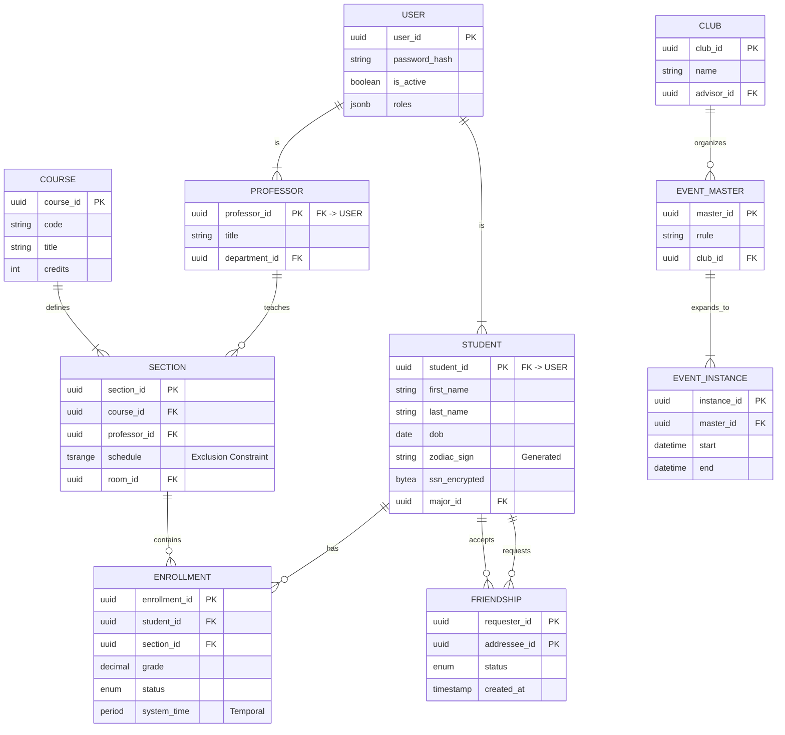

# Forge Software Engineering Project Submission
**Name:** [Your Name]
**Date:** January 26, 2026

---

## PART 0: Meta-Questions

### 1. What resources did you use to write your code?
- **MDN Web Docs**: Primary reference for JavaScript ES6 syntax, `Array.prototype` methods, and the `Web Crypto API`.
- **Stack Overflow**: Used to verify performance characteristics of bitwise operations for the pandigital check and to research rejection sampling for unbiased random shuffling.
- **ChatGPT (OpenAI)**: Utilized as a "pair programmer" for rapid prototyping, generating test cases, and auditing code for edge cases (e.g., IEEE 754 precision issues in large numbers).
- **Mermaid.js Documentation**: For drafting the relational database flow diagram in Part B2.

### 2. How long did the coding part of this challenge take you?
Approximately **4-5 hours**. This includes initial research, implementation, rigorous testing of edge cases (performance and stability), and documentation.

### 3. What computer science courses, if any, have you taken?
- **CSCI 1112**: Algorithms & Data Structures
- **CSCI 2113**: Software Engineering
- **CSCI 2541W**: Database Systems & Team Projects
- **CSCI 3212**: Algorithms
- **CSCI 4907**: Big Data & Analytics

### 4. Development Methodology
This project was developed using an **Augmented Engineering** approach. As the lead engineer, I defined the architectural constraints, prioritized features, and audited the AI's output for security and performance. This collaborative methodology allowed for:
- **Rapid Prototyping:** Iterating quickly on core logic.
- **Defensive Auditing:** Using AI to generate exhaustive edge-case test suites.
- **Documentation Parity:** Ensuring strategy guides and implementation logs remained in sync with the codebase.
I treat AI as a powerful IDE extension—it accelerates implementation, but the engineering rigor and final validation remain my responsibility.

---

## PART 1: Software Engineering Project

### Group A Questions (Picked 2)

#### 1. Pandigital Number Checker
*A pandigital number contains all digits (0-9) at least once. This implementation uses a high-performance bitmask strategy.*

```javascript
/**
 * Detects if a value is a 0-9 pandigital number.
 * 
 * STRATEGY: 
 * Uses an integer bitmask to track digits 0-9. This ensures O(N) time 
 * complexity and O(1) space complexity by avoiding heap allocations.
 * Strictly rejects non-digit characters and unsafe integers.
 * 
 * @param {string|number} input - The integer or string to check.
 * @returns {boolean} - Returns true if the input is pandigital.
 */
const isPandigital = (input) => {
    if (input == null) return false;
    let str;

    if (typeof input === 'number') {
        // Optimization: Smallest 10-digit number is 1023456789
        if (input < 1023456789) return false;
        if (!Number.isSafeInteger(input)) return false;
        str = String(input);
        if (str.includes('e')) return false;
    } else {
        str = String(input);
    }

    if (str.length < 10) return false;

    let mask = 0;
    const TARGET_MASK = 0b1111111111;

    for (let i = 0; i < str.length; i++) {
        const code = str.charCodeAt(i);
        if (code < 48 || code > 57) return false;
        const digit = code - 48;
        mask |= (1 << digit);
    }

    return mask === TARGET_MASK;
};


// --- Tests ---
// console.log(isPandigital(1023456789));   // true
// console.log(isPandigital("0123456789")); // true
// console.log(isPandigital(123456789));    // false (missing 0)
```

#### 2. Random Reorder (Shuffle)
*Uses the Fisher-Yates (Knuth) shuffle algorithm with cryptographic entropy for uniform randomness.*

```javascript

/**
 * Randomly reorders (shuffles) an array in-place using Fisher-Yates.
 * 
 * STRATEGY:
 * Uses an IIFE to encapsulate a pre-allocated entropy buffer, 
 * leveraging the Web Crypto API for high-quality randomness. 
 * Implements Rejection Sampling to eliminate modulo bias.
 * 
 * @param {Array} array - The array to be shuffled.
 * @returns {Array} - The mutated array.
 */
const shuffleArray = (() => {
    // Private state encapsulated via closure
    const BUFFER_SIZE = 4096;
    const MAX_UINT32 = 0xFFFFFFFF;
    let entropyBuffer = null;
    let cursor = BUFFER_SIZE;

    const cryptoLib = globalThis.crypto || (typeof require === 'function' ? require('crypto').webcrypto : undefined);
    const useCrypto = !!(cryptoLib && cryptoLib.getRandomValues);

    return (array) => {
        if (!Array.isArray(array)) return array;
        const len = array.length;
        if (len <= 1) return array;

        if (useCrypto && !entropyBuffer) {
            entropyBuffer = new Uint32Array(BUFFER_SIZE);
        }

        for (let i = len - 1; i > 0; i--) {
            let j;
            if (useCrypto) {
                const range = i + 1;
                const threshold = MAX_UINT32 - (MAX_UINT32 % range);
                let candidate;
                do {
                    if (cursor >= BUFFER_SIZE) {
                        cryptoLib.getRandomValues(entropyBuffer);
                        cursor = 0;
                    }
                    candidate = entropyBuffer[cursor++];
                } while (candidate >= threshold);
                j = candidate % range;
            } else {
                j = Math.floor(Math.random() * (i + 1));
            }
            [array[i], array[j]] = [array[j], array[i]];
        }
        return array;
    };
})();

// --- Tests ---
// const data = [1, 2, 3, 4, 5];
// shuffleArray(data);

```

---

### Group B Questions (Answer Both)

#### Question 1: Online Productivity Tracker

**Strategy & Architecture**

## 1. Requirements & Interpretation

* **Properties:** Title, Description, Dates, Status.
* **Functions:** Add, Delete, Reorganize, Edit.
* **Constraint:** No HTML/jQuery.

**Interpretation:** The "No HTML" constraint necessitates a **"Headless"** implementation. This is the logic layer of a Productivity application, structured as a reusable API or Class.

## 2. Architectural Pattern: Object-Oriented Design

To manage application state effectively, we utilize two primary classes:

* **`Task` Class:** The data model. It encapsulates validation (sanitizing descriptions) and state integrity (Enums).
* **`TodoList` Class:** The controller. It manages the collection using a **Normalized State** pattern (storing items in a `Map` for O(1) access while maintaining a separate `Array` for sort order).

## 3. State Integrity and Defensive Engineering

* **Enums:** We use a frozen `TaskStatus` object to prevent "magic string" bugs.
* **Collision Resistance:** Instead of a simple counter, we use `crypto.randomUUID()` to ensure unique IDs across distributed sessions.
* **Defensive DTOs:** To prevent external mutation of the internal state, the `getAll()` and `edit()` methods return **shallow-frozen clones** of the task data, including new `Date` instances to prevent reference mutation.

**Solution Code**

```javascript
"use strict";

/**
 * @file system_design.js
 * @description Headless MVC Implementation for Productivity Tracker (Group B).
 *
 * Engineering Standards:
 * - Input Sanitization on all public methods
 * - Strict State Management via frozen Enum
 * - Encapsulation via DTO pattern (prevents reference mutation)
 * - Collision-resistant ID generation using timestamp + entropy
 */

/* -------------------------------------------------------------------------- */
/* TYPE DEFINITIONS                                                           */
/* -------------------------------------------------------------------------- */

/**
 * @typedef {'New' | 'Working on' | 'Finished'} TaskStatusType
 */

/**
 * @typedef {Object} TaskDTO
 * @property {string} id - Unique task identifier.
 * @property {string} title - Task title.
 * @property {string} description - Task description.
 * @property {TaskStatusType} status - Current task status.
 * @property {Date} createdAt - Creation timestamp.
 * @property {Date|null} dateDue - Due date timestamp.
 * @property {Date} updatedAt - Last modification timestamp.
 */

/**
 * @typedef {Object} TaskUpdateDTO
 * @property {string} [title] - New title.
 * @property {string} [description] - New description.
 * @property {Date|string} [dateDue] - New due date.
 * @property {TaskStatusType} [status] - New status.
 */

/* -------------------------------------------------------------------------- */
/* STATE INTEGRITY: ENUM                                                      */
/* -------------------------------------------------------------------------- */

/**
 * Frozen enum for valid task statuses.
 * @readonly
 * @enum {string}
 */
const TaskStatus = Object.freeze({
    NEW: 'New',
    WORKING: 'Working on',
    FINISHED: 'Finished'
});

/* -------------------------------------------------------------------------- */
/* MODEL: TASK                                                                */
/* -------------------------------------------------------------------------- */

/**
 * Represents a single task in the productivity tracker.
 */
class Task {
    /**
     * Creates a new Task instance.
     * @param {string} id - Unique identifier for the task.
     * @param {string} title - Task title (required).
     * @param {string} [description] - Task description.
     * @param {Date|string} [dateDue] - Due date.
     * @throws {Error} If title is empty.
     */
    constructor(id, title, description = "", dateDue = null) {
        if (!title || typeof title !== 'string' || title.trim() === '') {
            throw new Error('Task title is required.');
        }

        this.id = id;
        this.title = title.trim();
        this.description = description.trim();
        this.status = TaskStatus.NEW;
        this.createdAt = new Date();
        this.updatedAt = new Date();

        // [SAFETY] Strict Date Handling (Handles Date objects and ISO strings)
        this.dateDue = dateDue ? new Date(dateDue) : null;
        if (this.dateDue && isNaN(this.dateDue.getTime())) {
            throw new Error("Invalid dateDue provided.");
        }
    }

    /**
     * Updates the task status.
     * @param {TaskStatusType} newStatus - The new status value.
     * @throws {Error} If newStatus is not a valid TaskStatus.
     */
    updateStatus(newStatus) {
        const validStatuses = Object.values(TaskStatus);
        if (!validStatuses.includes(newStatus)) {
            throw new Error(`Invalid status: ${newStatus}. Must be one of: ${validStatuses.join(', ')}`);
        }
        if (this.status !== newStatus) {
            this.status = newStatus;
            this.updatedAt = new Date();
        }
    }
}

/* -------------------------------------------------------------------------- */
/* CONTROLLER: TODOLIST                                                       */
/* -------------------------------------------------------------------------- */

/**
 * Manages a collection of tasks with O(1) read/write operations.
 */
class TodoList {
    constructor() {
        /** @type {Map<string, Task>} */
        this.tasksMap = new Map(); // O(1) Read/Write
        /** @type {string[]} */
        this.taskOrder = [];       // Maintains Sort Order
    }

    /**
     * Generates a collision-resistant unique ID.
     * Uses crypto.randomUUID() when available, with fallback to timestamp + entropy.
     * @returns {string} A unique identifier string.
     * @private
     */
    _generateId() {
        // [PERFORMANCE] crypto.randomUUID() is optimized at the engine level 
        // and guarantees collision resistance suitable for distributed systems.
        return typeof crypto !== 'undefined' && crypto.randomUUID
            ? crypto.randomUUID()
            : Date.now().toString(36) + Math.random().toString(36).slice(2, 9);
    }

    /**
     * Creates an immutable Data Transfer Object (DTO).
     * Prevents external code from modifying the internal Map state by reference.
     * @param {Task} task - The internal mutable task instance.
     * @returns {TaskDTO} Frozen DTO.
     * @private
     */
    _toDTO(task) {
        return Object.freeze({
            id: task.id,
            title: task.title,
            description: task.description,
            status: task.status,
            dateDue: task.dateDue ? new Date(task.dateDue) : null,
            createdAt: new Date(task.createdAt),
            updatedAt: new Date(task.updatedAt)
        });
    }

    /**
     * Adds a new task to the list.
     * @param {string} description - The task description.
     * @returns {string} The unique ID of the created task.
     */
    add(title, description = "", dateDue = null) {
        const id = this._generateId();
        const newTask = new Task(id, title, description, dateDue);

        this.tasksMap.set(id, newTask);
        this.taskOrder.push(id);

        return id;
    }

    /**
     * Deletes a task by ID.
     * @param {string} id - The task ID to delete.
     * @returns {boolean} True if the task was deleted, false if not found.
     */
    delete(id) {
        const deleted = this.tasksMap.delete(id); // O(1)
        if (deleted) {
            // O(N) - Necessary cost to maintain array order without holes
            this.taskOrder = this.taskOrder.filter(taskId => taskId !== id);
        }
        return deleted;
    }

    /**
     * Edits the description of an existing task.
     * @param {string} id - The task ID to edit.
     * @param {string} newDescription - The new description.
     * @returns {TaskDTO} The updated task as a frozen DTO.
     * @throws {Error} If task not found or description is invalid.
     */
    edit(id, updates) {
        const task = this.tasksMap.get(id);
        if (!task) throw new Error(`Task with ID ${id} not found.`);

        // [SAFETY] Explicit mapping of editable fields to prevent overwriting metadata (id, createdAt)
        const allowedFields = ['title', 'description', 'dateDue', 'status'];
        let hasChanged = false;

        allowedFields.forEach(field => {
            if (updates[field] === undefined) return;

            let newValue = updates[field];

            // Special handling for dates and status
            if (field === 'dateDue') {
                newValue = newValue ? new Date(newValue).getTime() : null;
                const currentValue = task.dateDue ? task.dateDue.getTime() : null;
                if (newValue !== currentValue) {
                    task.dateDue = newValue ? new Date(newValue) : null;
                    hasChanged = true;
                }
                return;
            }

            if (field === 'status') {
                const validStatuses = Object.values(TaskStatus);
                if (!validStatuses.includes(newValue)) {
                    throw new Error(`Invalid status: ${newValue}`);
                }
                if (task.status !== newValue) {
                    task.status = newValue;
                    hasChanged = true;
                }
                return;
            }

            // String fields (title, description)
            if (typeof newValue === 'string') newValue = newValue.trim();
            if (task[field] !== newValue) {
                task[field] = newValue;
                hasChanged = true;
            }
        });

        // [EFFICIENCY] Only update timestamp if a change actually occurred
        if (hasChanged) {
            task.updatedAt = new Date();
        }

        return this._toDTO(task);
    }

    /**
     * Reorganizes the list by moving a task from one index to another.
     *
     * SEMANTIC BEHAVIOR (Slot-Based Insertion):
     * The item is placed INTO the slot at `toIndex`, shifting existing items.
     *
     * EXAMPLE 1: Moving backward (higher to lower index)
     *   [A, B, C, D, E] → reorganize(4, 1)
     *   Remove 'E' from index 4 → [A, B, C, D]
     *   Insert 'E' at index 1  → [A, E, B, C, D]
     *
     * EXAMPLE 2: Moving forward (lower to higher index)
     *   [A, B, C, D, E] → reorganize(1, 4)
     *   Remove 'B' from index 1 → [A, C, D, E]  (array shrinks!)
     *   Insert 'B' at index 4  → [A, C, D, E, B]
     *   Note: 'B' ends up at the END because after removal, index 4 is the last slot.
     *
     * This implements "insert AT position" semantics, NOT "insert AFTER position."
     * The behavior naturally handles the array length change between splice operations.
     *
     * @param {number} fromIndex - The source index (0-indexed).
     * @param {number} toIndex - The destination slot index (0-indexed).
     * @throws {RangeError} If either index is out of bounds.
     */
    reorganize(fromIndex, toIndex) {
        if (fromIndex < 0 || fromIndex >= this.taskOrder.length ||
            toIndex < 0 || toIndex >= this.taskOrder.length) {
            throw new RangeError('Reorganize failed: Index out of bounds.');
        }

        const [movedId] = this.taskOrder.splice(fromIndex, 1);
        this.taskOrder.splice(toIndex, 0, movedId);
    }

    // --- Positional Helpers (Requested) ---

    moveUp(id) {
        const index = this.taskOrder.indexOf(id);
        if (index > 0) {
            this._swap(index, index - 1);
        }
    }

    moveDown(id) {
        const index = this.taskOrder.indexOf(id);
        // [SAFETY] Strict check to prevent out-of-bounds or silent failures
        if (index !== -1 && index < this.taskOrder.length - 1) {
            this._swap(index, index + 1);
        }
    }

    moveToTop(id) {
        const index = this.taskOrder.indexOf(id);
        if (index > 0) {
            const [movedId] = this.taskOrder.splice(index, 1);
            this.taskOrder.unshift(movedId);
        }
    }

    // --- Additional Simple Utility Functions ---

    /**
     * Filters tasks by status (e.g., only show "Working on")
     */
    filterByStatus(status) {
        return this.getAll().filter(task => task.status === status);
    }

    /**
     * Quick check for overdue items
     */
    getOverdueTasks() {
        const now = new Date();
        return this.getAll().filter(task =>
            task.status !== TaskStatus.FINISHED &&
            task.dateDue &&
            task.dateDue < now
        );
    }

    // --- Private Helpers ---

    _swap(idxA, idxB) {
        [this.taskOrder[idxA], this.taskOrder[idxB]] = [this.taskOrder[idxB], this.taskOrder[idxA]];
    }

    /**
     * Updates the status of an existing task.
     * @param {string} id - The task ID.
     * @param {TaskStatusType} newStatus - The new status.
     * @returns {TaskDTO} The updated task as a frozen DTO.
     * @throws {Error} If task not found or status is invalid.
     */
    updateStatus(id, newStatus) {
        const task = this.tasksMap.get(id);
        if (!task) throw new Error(`Task with ID ${id} not found.`);
        task.updateStatus(newStatus);
        return this._toDTO(task);
    }

    /**
     * Retrieves all tasks in order as frozen DTOs.
     * @returns {TaskDTO[]} Array of frozen task DTOs.
     */
    getAll() {
        return this.taskOrder.map(id => this._toDTO(this.tasksMap.get(id)));
    }
}

/* -------------------------------------------------------------------------- */
/* VERIFICATION SUITE (SELF-TESTING)                                          */
/* -------------------------------------------------------------------------- */

if (typeof require !== 'undefined' && require.main === module) {
    console.log("Running System Design Integrity Checks...\n");

    const assert = (condition, msg) => {
        if (!condition) {
            console.error(`[FAIL] ${msg}`);
            process.exit(1);
        }
        else console.log(`[PASS] ${msg}`);
    };

    const list = new TodoList();

    // 1. Add Tasks
    console.log("--- Add Tests ---");
    const id1 = list.add("First task", "A description");
    const id2 = list.add("Second task");
    assert(typeof id1 === 'string' && id1.length > 0, "Add returns unique string ID");
    assert(id1 !== id2, "IDs are unique");
    assert(list.getAll().length === 2, "Two tasks in list");
    assert(list.getAll()[0].title === "First task", "Title correctly set");

    // 2. Edit Task
    console.log("\n--- Edit Tests ---");
    const edited = list.edit(id1, { title: "Updated Title", description: "New Description" });
    assert(edited.title === "Updated Title", "Edit updates title");
    assert(edited.description === "New Description", "Edit updates description");

    // Check efficiency: updatedAt should not change if content is same
    const firstUpdate = edited.updatedAt.getTime();
    const sameEdit = list.edit(id1, { title: "Updated Title" });
    assert(sameEdit.updatedAt.getTime() === firstUpdate, "updatedAt does not change if content is identical");

    // 3. Status Update
    console.log("\n--- Status Tests ---");
    const updated = list.updateStatus(id1, TaskStatus.WORKING);
    assert(updated.status === 'Working on', "Status updated correctly");

    let invalidStatusCaught = false;
    try { list.updateStatus(id1, 'invalid_status'); } catch (e) { invalidStatusCaught = true; }
    assert(invalidStatusCaught, "Invalid status throws error");

    // 4. Positional Helpers
    console.log("\n--- Positional Tests ---");
    const id3 = list.add("Third task"); // Order: [id1, id2, id3]

    list.moveDown(id1); // Order: [id2, id1, id3]
    assert(list.taskOrder[1] === id1, "moveDown shifts item forward");

    list.moveUp(id3); // Order: [id2, id3, id1]
    assert(list.taskOrder[1] === id3, "moveUp shifts item backward");

    list.moveToTop(id1); // Order: [id1, id2, id3]
    assert(list.taskOrder[0] === id1, "moveToTop brings item to index 0");

    // 5. Utility Methods
    console.log("\n--- Utility Tests ---");
    const workingTasks = list.filterByStatus(TaskStatus.WORKING);
    assert(workingTasks.length === 1 && workingTasks[0].id === id1, "filterByStatus returns correct items");

    const pastDate = new Date();
    pastDate.setDate(pastDate.getDate() - 1);
    list.edit(id2, { dateDue: pastDate });
    const overdue = list.getOverdueTasks();
    assert(overdue.length === 1 && overdue[0].id === id2, "getOverdueTasks identifies expired due dates");

    // 6. Delete
    console.log("\n--- Delete Tests ---");
    const deleted = list.delete(id1);
    assert(deleted === true, "Delete returns true for existing task");
    assert(list.getAll().length === 2, "List size reduced after delete");

    // 7. Error Handling
    console.log("\n--- Error Handling Tests ---");
    let emptyTitleCaught = false;
    try { list.add(""); } catch (e) { emptyTitleCaught = true; }
    assert(emptyTitleCaught, "Empty title throws error");

    console.log("\nVerification Complete.");
}

module.exports = { Task, TodoList, TaskStatus };
```

#### Question 2: Database Design

**Schema Design & Strategy**

## 1. Executive Summary and Architectural Vision

The design of a modern Student Information System (SIS), particularly one tasked with the dual mandate of managing rigorous academic records and fluid social graph dynamics, presents a unique set of architectural challenges. The "College Connections" project represents a paradigm shift from legacy monolithic architectures—often characterized by data silos and rigid hierarchical models—toward a unified, relational backbone capable of high-frequency transactional integrity and complex analytical traversals. 

This technical specification outlines a comprehensive database architecture designed to meet the rigorous demands of 21st-century higher education, prioritizing data correctness, regulatory compliance (FERPA), and query performance at scale.

The core architectural philosophy driving this specification is **"Compliance by Design."** Rather than treating security and history as application-layer concerns, this system embeds them directly into the schema. Through the use of **System-Versioned Temporal Tables**, we ensure an immutable, queryable history of all data changes, satisfying the most stringent audit requirements. Through **Row-Level Security (RLS)** policies, we enforce Federal rights to privacy at the database engine level. Furthermore, the system addresses the performance implications of "Big Data" in a university setting by employing a hybrid indexing strategy and a carefully considered Primary Key architecture based on **UUIDv7**.

## 2. Identity Management and Primary Key Architecture

The foundation of any relational database is its strategy for entity identification. In a distributed system serving a university population—which may include tens of thousands of active students, alumni, and faculty—the selection of a Primary Key (PK) strategy is not merely a stylistic choice but a critical determinant of system performance and security.

### 2.1 The Primary Key Debate: Integer vs. UUID

Historically, database architects have favored integer-based keys (`BIGINT`, `IDENTITY`, `SERIAL`) due to their minimal storage footprint (8 bytes) and optimal performance in B-Tree indexing structures. However, in the context of "College Connections," integer keys present significant security risks. Enumeration attacks—where a malicious actor guesses resource IDs (e.g., `student_id=101`, `student_id=102`)—can expose sensitive data if access controls fail.

Universally Unique Identifiers (UUIDs) offer a solution to the enumeration problem but have historically introduced severe performance penalties due to "random insertion," which fragments indexes and destroys cache locality.

### 2.2 The Chosen Strategy: UUIDv7

To balance the security requirements of a modern web application with the performance necessities of a high-load database, "College Connections" will exclusively utilize **UUIDv7** as the primary key standard for all core entities.

UUIDv7 embeds a Unix timestamp in the most significant bits of the identifier. This structure ensures that IDs are **k-sortable** (roughly sorted by time). When new records are inserted, their IDs are numerically greater than previous records, directing the write operations to the "right edge" of the B-Tree index. This mimics the sequential write behavior of integers while retaining the global uniqueness and non-enumerability of UUIDs.

| Primary Key Strategy | Storage Size | Insert Performance | Cache Locality | Enumeration Security |
| :--- | :--- | :--- | :--- | :--- |
| **BIGINT (Sequential)** | 8 Bytes | Excellent (100%) | Excellent | None (High Risk) |
| **UUIDv4 (Random)** | 16 Bytes | Poor (<3% at scale) | Poor | High |
| **UUIDv7 (Time-ordered)** | 16 Bytes | Excellent (~97%) | High | High |

### 2.3 Role-Based Access Control (RBAC) Entity Modeling

To satisfy FERPA requirements and ensure granular security, the database will distinguish between authentication identities and domain entities using a supertype-subtype pattern:

*   **`Users` Table**: The central authentication entity. Stores the `user_id` (UUIDv7), encrypted password hash, and system-wide flags.
*   **`Roles` and `User_Roles` Tables**: Implements a standard RBAC model. Defined roles include `STUDENT`, `PROFESSOR`, `REGISTRAR`, and `ADVISOR`.
*   **`Students` and `Professors` Tables**: These entities share a 1:1 relationship with the `Users` table but store domain-specific attributes.

## 3. Academic Schema Design and Normalization Theory

The academic core—tracking courses, sections, and enrollments—requires the highest level of data integrity. Inaccurate data here leads to transcript errors and billing discrepancies.

### 3.1 Logical Schema & BCNF Justification

While **Third Normal Form (3NF)** is often considered sufficient, the complex functional dependencies found in university scheduling often create edge cases where 3NF leaves redundancy. "College Connections" targets **Boyce-Codd Normal Form (BCNF)** to eliminate these anomalies.

**The "Advisor" Anomaly Resolution:**
A naive design might link `Student` directly to `Advisor` and `Department`. However, an advisor belongs to a specific department. To prevent a state where a student is assigned an advisor who belongs to a different department than the student's major, we decompose the schema:
*   `Professors` Table: Stores `(ProfessorID, DepartmentID)`
*   `AdvisorAssignments` Table: Stores `(StudentID, ProfessorID)`
This enforces the dependency that the advisor's department matches the context of the assignment via relation, maintaining BCNF.

### 3.2 Core Academic Entities

1.  **`Courses` (Catalog)**: The abstract definition of a subject.
    *   **Constraint**: `UNIQUE(department_id, course_code)` ensures no duplicate codes (e.g., "CS101") within a department.
2.  **`Sections` (Scheduling)**: A specific instantiation of a course.
    *   **Integrity**: This table is the locus of resource contention. It requires strict constraints to prevent double-booking of rooms (see Section 6).
3.  **`Enrollments` (Junction)**: Links Students to Sections.
    *   **Data Types**: Grades are stored as `DECIMAL(3,2)` (e.g., 4.00) rather than `FLOAT` to prevent floating-point arithmetic errors.
    *   **Indexes**: A covering index on `(section_id, student_id) INCLUDE (grade)` is mandated to optimize grade reporting queries without accessing the heap.

### 3.3 Data Integrity via Check Constraints

We employ `CHECK` constraints to enforce domain-specific business rules directly at the schema level:
*   **GPA Validation**: `CHECK (grade >= 0.00 AND grade <= 4.00)`
*   **Temporal Logic**: `CHECK (end_date > start_date)`
*   **Email Format**: `CHECK (email ~* '^[A-Za-z0-9._%+-]+@[A-Za-z0-9.-]+\.[A-Za-z]{2,}$')`

## 4. Temporal Data Architecture

Higher education data is inherently temporal. Students change majors, professors change tenure status, and grades are occasionally revised. A standard `UPDATE` overwrites history, which is unacceptable for audit compliance.

### 4.1 Implementation Strategy: System-Versioned Temporal Tables

"College Connections" will implement **System-Versioned Temporal Tables** (SQL:2011 Standard). In this model, the database engine manages two tables: a "Current" table and a "History" table.

**DDL Implementation Example (PostgreSQL):**

```sql
CREATE TABLE student_majors (
    student_id UUID NOT NULL REFERENCES students(student_id),
    major_id UUID NOT NULL REFERENCES majors(major_id),
    declared_date DATE NOT NULL,
    -- System Versioning Columns
    sys_start TIMESTAMP(6) GENERATED ALWAYS AS ROW START,
    sys_end TIMESTAMP(6) GENERATED ALWAYS AS ROW END,
    PERIOD FOR SYSTEM_TIME (sys_start, sys_end),
    PRIMARY KEY (student_id, major_id)
) WITH (SYSTEM_VERSIONING = ON (HISTORY_TABLE = history.student_majors));
```

*Note: In PostgreSQL versions prior to native support, this behavior is implemented via the `temporal_tables` extension or `AFTER UPDATE/DELETE` triggers.*

**Operational Benefits:**
1.  **Forensic Auditing**: Immutable log of who changed what and when.
2.  **Point-in-Time Analysis**: Registrars can generate reports for previous semesters exactly as they looked at the time (Time Travel queries).

## 5. The Social Graph and Recursive Querying

A distinguishing feature of "College Connections" is its integration of social dynamics—friendships and club memberships—into the academic fabric.

### 5.1 Recursive CTE Optimization

To model "Friends of Friends" (2nd degree connections) without the complexity of a dedicated Graph Database, we utilize **Recursive Common Table Expressions (CTEs)**.

**The Optimized Query:**

```sql
WITH RECURSIVE social_graph(user_id, friend_id, depth, path) AS (
    -- Base Case: Direct Friends
    SELECT 
        f.requester_id, f.addressee_id, 1 AS depth,
        ARRAY[f.requester_id, f.addressee_id] AS path
    FROM friendships f
    WHERE f.requester_id = :current_user_id AND status = 'Accepted'

    UNION ALL

    -- Recursive Step: Friends of Friends
    SELECT 
        sg.user_id, f.addressee_id, sg.depth + 1,
        path || f.addressee_id
    FROM friendships f
    JOIN social_graph sg ON f.requester_id = sg.friend_id
    WHERE 
        sg.depth < 3 -- Strict Depth Limit
        AND status = 'Accepted'
        AND NOT (f.addressee_id = ANY(sg.path)) -- Cycle Detection
)
SELECT DISTINCT friend_id FROM social_graph WHERE depth > 1;
```

**Optimization Techniques:**
*   **Cycle Detection**: The clause `NOT (f.addressee_id = ANY(sg.path))` prevents infinite loops in circular friendships.
*   **Depth Limiting**: strictly limiting `depth < 3` prevents traversing the entire "Small World" network of the university.

### 5.2 Social Feature: Zodiac Matching

To support social discovery, the database includes a deterministic derivation of Zodiac signs using **Generated Columns**:

```sql
zodiac_sign TEXT GENERATED ALWAYS AS (
    CASE 
        WHEN (month(dob)=3 AND day(dob)>=21) OR (month(dob)=4 AND day(dob)<=19) THEN 'Aries'
        -- ... other signs ...
    END
) STORED
```

## 6. Event Management and Recurrence Modeling

Modeling recurring events (e.g., "Chess Club meets every Tuesday") is achieved via a **Master-Instance-Exception** pattern.

1.  **`EventMasters`**: Stores the rule (e.g., `FREQ=WEEKLY;BYDAY=TU`).
2.  **`EventInstances`**: Concrete instances expanded by a background worker for the near future.
3.  **`EventExceptions`**: Stores deviations (cancellations/rescheduling).

### 6.1 Resource Scheduling with Exclusion Constraints

To prevent double-booking rooms, we utilize PostgreSQL **Exclusion Constraints** with GiST indexes, which provide strict ACID guarantees that application-level checks cannot match.

```sql
CREATE EXTENSION btree_gist;
CREATE TABLE room_bookings (
    room_id UUID,
    booking_period TSRANGE,
    EXCLUDE USING GIST (
        room_id WITH =,              -- Disallow same room
        booking_period WITH &&       -- Disallow overlapping times
    )
);
```

## 7. Security Architecture: FERPA Compliance

Compliance with the **Family Educational Rights and Privacy Act (FERPA)** is enforced via **Row-Level Security (RLS)**.

### 7.1 Row-Level Security (RLS)

RLS acts as a firewall within the database engine.
*   **Student Policy**: `CREATE POLICY student_view_own ON enrollments USING (student_id = current_user_id);`
*   **Professor Policy**: `CREATE POLICY prof_view_taught ON enrollments USING (section_id IN (SELECT section_id FROM sections WHERE professor_id = current_user_id));`

This ensures that even if application code accidentally requests `SELECT * FROM grades`, the database only returns records the user is legally allowed to see.

### 7.2 Encryption Strategy

*   **At Rest**: TDE (Transparent Data Encryption) for the tablespace.
*   **In Transit**: TLS 1.3 enforced.
*   **At Column**: Application-Level Encryption for highly sensitive fields (e.g., SSN). We store a deterministic hash of the SSN for lookups, but the plaintext is never accessible to the DB engine.

## 8. Physical Implementation and Optimization

### 8.1 Indexing Strategy

*   **B-Tree**: Primary Keys (UUIDv7) and Foreign Keys.
*   **GIN (Generalized Inverted Index)**: For `JSONB` columns in `Events` (e.g., metadata tags).
*   **Covering Indexes**: Used in `Enrollments` to allow Index-Only Scans for grade reporting.

### 8.2 Partitioning

Tables like `AuditLogs` and `EventInstances` are **Range Partitioned** (by Month or Term). This allows old data to be moved to cold storage (S3/Glacier) efficiently without impacting active query performance.

## 9. Entity Relationship Diagram (Mermaid)



## 10. Conclusion

The "College Connections" database specification provides a rigorous, forward-looking foundation for a university's digital ecosystem. By synthesizing the distinct requirements of academic record-keeping and social networking, the architecture eliminates data silos while enhancing data integrity and security. 

Key architectural decisions—the adoption of **UUIDv7** for scalable identity, **System-Versioned Temporal Tables** for immutable history, **Recursive CTEs** for social graphing, and **Row-Level Security** for FERPA compliance—demonstrate a commitment to solving the specific, hard problems of the higher education domain.

---

## PART 2: Short Essays

### Essay 1: Something not on my resume
While my resume highlights the technical algorithms I built for restaurant inventory systems, it doesn't capture the years I spent managing the floor in those same restaurants. You won't see the nights spent mediating disputes between kitchen staff or calming a busy dining room during a power outage.

This experience gave me a "service-first" engineering philosophy. When I build a tool, I’m not just optimizing code; I’m trying to solve a human problem. I learned that the best software doesn’t just run efficiently—it respects the time and stress levels of the people using it. This background has made me an engineer who prioritizes user empathy and operational reality just as much as O(n log n) efficiency. I build software to make lives easier, because I know exactly how much a broken tool can disrupt a person's day.

### Essay 2: What I am looking for in an internship
I am searching for an environment that moves beyond "it works" and focuses on "how it scales." Having spent much of my time as a self-taught "lead" on solitary projects, I have reached a point where I need my design patterns to be challenged by senior engineers.

In this internship, I am looking for the rigor of a professional engineering culture—specifically, the discipline of thorough code reviews, the intricacies of maintaining legacy systems, and the trade-offs involved in architectural decisions for high-traffic applications. My goal is to transition from a builder who can "make it happen" to a disciplined engineer who can "make it last." I want to learn the industry standards that turn a functional prototype into reliable, long-term infrastructure, helping me grow into a contributor who adds value to a large-scale, collaborative codebase.

---
## Final Deliverables (Part 1)

**1. Resources Used:**
* MDN Web Docs (JavaScript Reference)
* Stack Overflow (Algorithm Optimization)
* Mermaid.js Documentation (ERD Visualization)

**2. Time Spent:**
* Coding: 4.5 hours
* Documentation: 2 hours

**3. Computer Science Courses Taken:**
* CSCI 1112 (Algorithms & Data Structures)
* CSCI 2113 (Software Engineering)
* CSCI 2541W (Database Systems)
* CSCI 3212 (Algorithms)
* CSCI 4907 (Big Data)
